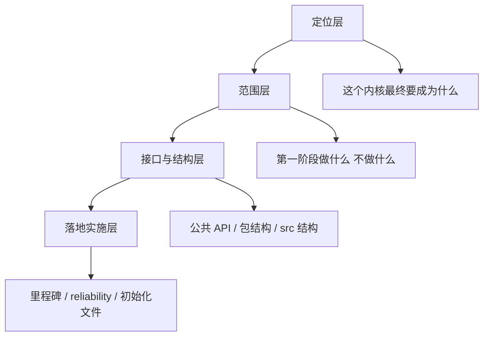
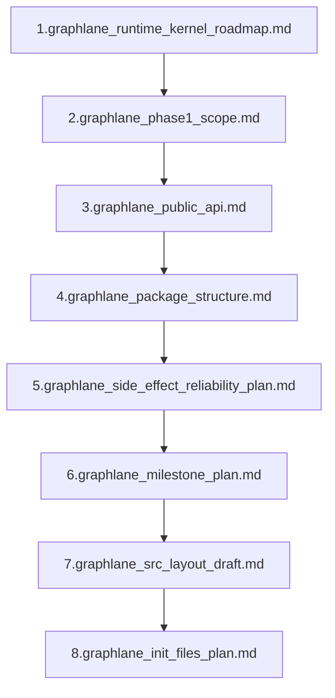

# Graphlane Docs Guide

这份 README 是 `open_source_todo/` 的总入口。

它解决的问题不是“再新增设计”，而是：

> 现在这些文档应该按什么顺序看，才能逐步建立对 Graphlane 内核的理解。

如果你现在的感受是：

- 文档都能看懂一点
- 但整体脑子里还没有一张稳定地图

那就从这份开始。

---

## 1. 先建立一个总图

Graphlane 现在这套文档，实际上分成 4 层：

也就是说，不要把这些文档当成平级材料看。  
它们不是“8 篇都差不多重要”，而是有先后关系的。

---

## 2. 文档地图

### 2.1 定位层

- `graphlane_runtime_kernel_roadmap.md`

回答：

- Graphlane 是什么
- 为什么它是 runtime kernel
- 最终目标架构是什么

这是总纲。

### 2.2 范围层

- `graphlane_phase1_scope.md`

回答：

- 第一阶段必须做什么
- 第一阶段明确不做什么
- runtime revision snapshot 到底包不包含版本快照

这是边界文档。

### 2.3 接口与结构层

- `graphlane_public_api.md`
- `graphlane_package_structure.md`
- `graphlane_src_layout_draft.md`

分别回答：

- 对外承诺什么 API
- 包怎么命名、怎么分层、怎么发 PyPI
- `src/graphlane/` 里文件怎么排

这是“内核长什么样”的文档组。

### 2.4 实施层

- `graphlane_milestone_plan.md`
- `graphlane_side_effect_reliability_plan.md`
- `graphlane_init_files_plan.md`

分别回答：

- 该按什么顺序推进
- side effect / outbox 为什么必须这么设计
- 第一批文件到底先建什么

这是“怎么把它做出来”的文档组。

---

## 3. 推荐阅读顺序

如果你想真正把这个内核想清楚，我建议按下面顺序读。

这个顺序的逻辑是：

1. 先知道“Graphlane 是什么”
2. 再知道“第一阶段做到哪里为止”
3. 再知道“对外 API 长什么样”
4. 再知道“包和代码结构长什么样”
5. 再补关键技术专题：outbox / reliability
6. 再看推进顺序
7. 最后再看文件级落地

---

## 4. 如果你只想先搞懂，不想看太细

那就只看这 3 份：

1. `graphlane_runtime_kernel_roadmap.md`
2. `graphlane_phase1_scope.md`
3. `graphlane_public_api.md`

这三份看完，你应该至少能回答：

- Graphlane 的定位是什么
- 第一阶段到底做什么
- 这个内核对外暴露哪些最核心对象

如果这三个问题还答不出来，就不要往后看更细的文档。

---

## 5. 如果你要开始动手做代码

那就看这 4 份：

1. `graphlane_phase1_scope.md`
2. `graphlane_package_structure.md`
3. `graphlane_src_layout_draft.md`
4. `graphlane_init_files_plan.md`

这条路线是“开工路线”，不是“理解路线”。

---

## 6. 如果你现在最困惑的是“版本”和“发布”

那你要重点看两份：

1. `graphlane_phase1_scope.md`
2. `graphlane_runtime_kernel_roadmap.md`

这里最重要的一句话是：

- 第一阶段做的是 `runtime revision`
- 第一阶段不做的是“产品化版本管理系统”

也就是：

- 要有 revision snapshot
- 要有 active revision
- 要有 revision 切换

但不要把它理解成：

- 草稿系统
- publish history 页面
- restore version 工作流

这一步必须先想清楚，不然后面会一直混。

---

## 7. 如果你现在最困惑的是“为什么要 outbox”

那就重点看：

1. `graphlane_runtime_kernel_roadmap.md`
2. `graphlane_side_effect_reliability_plan.md`

你只需要先抓住一句话：

> 对平台级 runtime kernel 来说，`graph_publish / graph_destroy / cache_invalidate` 不是“顺手副作用”，而是系统一致性的一部分。

一旦这样理解，`outbox` 的位置就清楚了。

---

## 8. 现在这套文档里，哪几份最关键

如果只允许保留 3 份，我会保留：

- `graphlane_runtime_kernel_roadmap.md`
- `graphlane_phase1_scope.md`
- `graphlane_public_api.md`

如果允许保留 5 份，再加：

- `graphlane_side_effect_reliability_plan.md`
- `graphlane_package_structure.md`

因为这 5 份已经足够构成：

- 定位
- 边界
- 对外 API
- 可靠性原则
- 包结构

---

## 9. 你现在应该怎么用这些文档

建议不是“每份都从头看到尾”，而是分三轮。

### 第一轮：只建立地图

读：

- `graphlane_runtime_kernel_roadmap.md`
- `graphlane_phase1_scope.md`

目标：

- 说清 Graphlane 是什么
- 说清 phase 1 到哪里为止

### 第二轮：建立公共表面

读：

- `graphlane_public_api.md`
- `graphlane_package_structure.md`

目标：

- 说清对外提供什么对象
- 说清包结构为什么这样分

### 第三轮：建立落地路径

读：

- `graphlane_side_effect_reliability_plan.md`
- `graphlane_milestone_plan.md`
- `graphlane_src_layout_draft.md`
- `graphlane_init_files_plan.md`

目标：

- 说清推进顺序
- 说清第一批代码怎么建

---

## 10. 一句话记忆法

如果你之后又忘了这些文档该怎么看，就记这三句话：

1. `roadmap` 解决“它是什么”
2. `scope + public_api` 解决“第一阶段交付什么”
3. `package + src + init + milestone + reliability` 解决“怎么做出来”

---

## 11. 当前建议

如果你现在的目标是先把自己脑子理顺，我建议你接下来就只做一件事：

按这个顺序重新读一遍：

1. `graphlane_runtime_kernel_roadmap.md`
2. `graphlane_phase1_scope.md`
3. `graphlane_public_api.md`

这三份吃透之后，再往后走。

如果这三份你愿意，我下一步可以继续帮你做一件更直接的事：

我按这三份文档的内容，给你写一份“Graphlane 内核的一页纸解释”，专门用来让你自己确认脑子里的模型是不是已经稳定。
