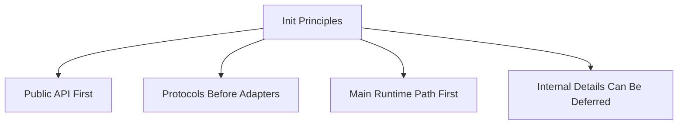
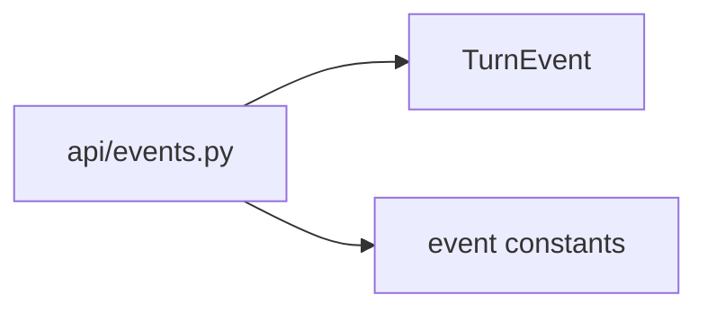
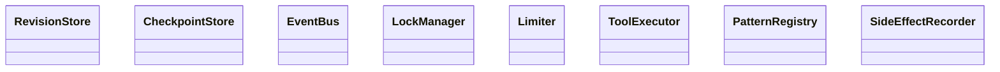
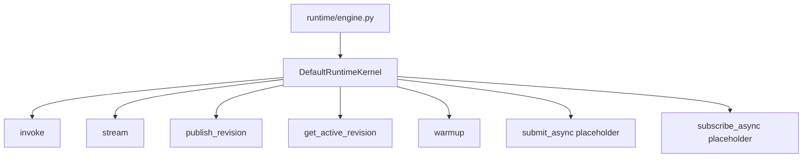
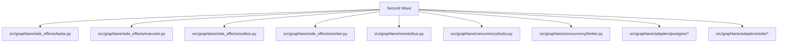
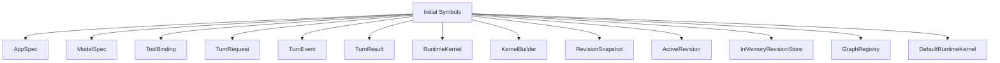
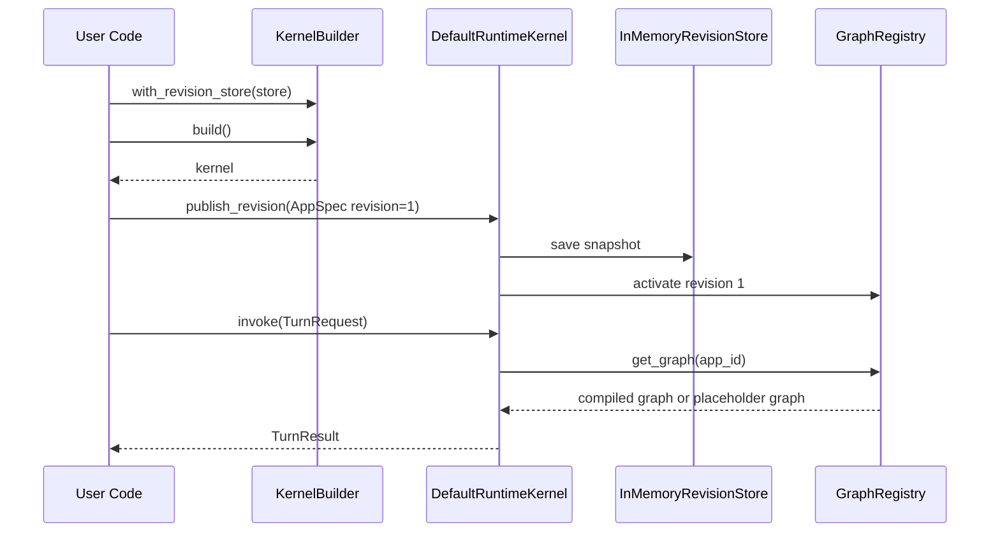
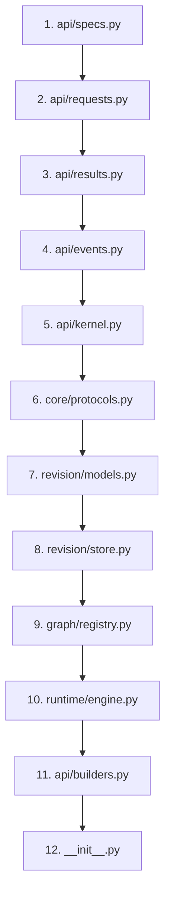
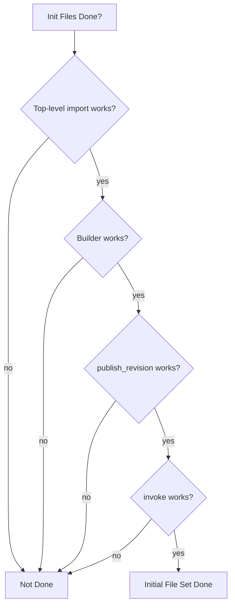

# Init Files Plan

这份文档把 `graphlane_src_layout_draft.md` 再往下推进一步：

- 第一批到底先创建哪些文件
- 每个文件先写哪些类和函数
- 哪些先写真实逻辑
- 哪些先放空实现

目标不是一次把所有代码写满，而是：

> 用最少的初始文件集合，把 `graphlane` 的第一版骨架真正立起来。

---

## 1. 初始化原则

第一批文件初始化遵循四条原则：

1. 先稳公共 API
2. 先稳协议和主语义
3. 先让主链闭环成立
4. 内部实现细节可以暂时留空



---

## 2. 第一批文件清单

建议第一批只初始化下面这些文件：

```mermaid
flowchart TD
    A[Initial File Set] --> B[src/graphlane/__init__.py]
    A --> C[src/graphlane/api/specs.py]
    A --> D[src/graphlane/api/requests.py]
    A --> E[src/graphlane/api/results.py]
    A --> F[src/graphlane/api/events.py]
    A --> G[src/graphlane/api/kernel.py]
    A --> H[src/graphlane/api/builders.py]
    A --> I[src/graphlane/core/protocols.py]
    A --> J[src/graphlane/revision/models.py]
    A --> K[src/graphlane/revision/store.py]
    A --> L[src/graphlane/graph/registry.py]
    A --> M[src/graphlane/runtime/engine.py]
```



这些文件的组合，足够支撑：

- 顶层 import 成立
- builder 成立
- revision 语义有落点
- graph registry 有落点
- runtime 主执行对象有落点

---

## 3. 第一批文件里的具体内容

### 3.1 `src/graphlane/__init__.py`

第一批应写：

- 顶层导出
- `__all__`
- 可选 `__version__` 占位

建议导出：

```python
from .api.specs import AppSpec, ModelSpec, ToolBinding
from .api.requests import TurnRequest
from .api.results import TurnResult
from .api.events import TurnEvent
from .api.kernel import RuntimeKernel
```

这一步必须是真实内容，不能只是空文件。

---

### 3.2 `src/graphlane/api/specs.py`

第一批应写真实内容：

- `ModelSpec`
- `ToolBinding`
- `AppSpec`

建议先用 `pydantic.BaseModel` 或 dataclass，不要一开始写太重。

建议第一版字段：

```python
class ModelSpec(...)
class ToolBinding(...)
class AppSpec(...)
```

必须是真实内容，因为这是所有主语义的根。

---

### 3.3 `src/graphlane/api/requests.py`

第一批应写真实内容：

- `TurnRequest`

建议字段：

- `app_id`
- `session_id`
- `turn_id`
- `query`
- `input`
- `metadata`
- `traceparent`

---

### 3.4 `src/graphlane/api/results.py`

第一批应写真实内容：

- `TurnResult`

建议字段：

- `turn_id`
- `session_id`
- `assistant_content`
- `finish_reason`
- `tool_records`
- `metrics`
- `error_message`

---

### 3.5 `src/graphlane/api/events.py`

第一批应写真实内容：

- `TurnEvent`
- 事件类型常量

建议常量：

- `EVENT_ASSISTANT_DELTA`
- `EVENT_TOOL_START`
- `EVENT_TOOL_END`
- `EVENT_PERFORMANCE_STATS`
- `EVENT_ERROR`
- `EVENT_DONE`



---

### 3.6 `src/graphlane/api/kernel.py`

第一批应写真实内容：

- `RuntimeKernel` 抽象类或 `Protocol`

建议最小方法签名：

- `invoke`
- `stream`
- `submit_async`
- `subscribe_async`
- `publish_revision`
- `get_active_revision`
- `warmup`

注意：

- 第一批先只定义接口
- 不在这里写具体实现

---

### 3.7 `src/graphlane/api/builders.py`

第一批应写半真实内容：

- `KernelBuilder`
- builder 属性字段
- `with_*` 系列方法
- `build()` 占位

建议：

- `with_revision_store`
- `with_checkpoint_store`
- `with_event_bus`
- `with_lock_manager`
- `with_limiter`
- `with_tool_executor`
- `with_pattern_registry`
- `build`

这里可以先让 `build()` 做最小参数校验，然后实例化一个最小 `DefaultRuntimeKernel`。

---

### 3.8 `src/graphlane/core/protocols.py`

第一批应写真实内容：

- `RevisionStore`
- `CheckpointStore`
- `EventBus`
- `LockManager`
- `Limiter`
- `ToolExecutor`
- `PatternRegistry`
- `SideEffectRecorder`



这里建议优先写 `Protocol`，不要一开始写实现。

---

### 3.9 `src/graphlane/revision/models.py`

第一批应写真实内容：

- `RevisionSnapshot`
- `ActiveRevision`

建议字段：

- `app_id`
- `revision`
- `spec`
- `created_at`

和：

- `app_id`
- `revision`
- `updated_at`

这一步非常关键，因为它明确了“一阶段版本快照”的真实对象。

---

### 3.10 `src/graphlane/revision/store.py`

第一批应写半真实内容：

- revision 相关协议
- 可能加一个最小 in-memory 实现

建议内容：

- `RevisionStore` re-export 或 helper
- `InMemoryRevisionStore`

为什么建议加一个 in-memory 版本：

- 方便最小 example
- 方便先跑 builder/kernel 主链

---

### 3.11 `src/graphlane/graph/registry.py`

第一批应写半真实内容：

- `GraphRegistry`
- 最小 active graph 缓存
- `get_graph`
- `publish_revision`
- `warmup`

第一批不用立刻把 history/grace cleanup 做满，但这些接口要有位置。

建议先内部放最小结构：

- `_active_graphs`
- `_active_revisions`

后面再演进出 `slot/history wrapper`。

---

### 3.12 `src/graphlane/runtime/engine.py`

第一批应写半真实内容：

- `DefaultRuntimeKernel`
- `invoke`
- `stream`
- `publish_revision`
- `get_active_revision`
- `warmup`

`submit_async` / `subscribe_async` 第一批可以先抛 `NotImplementedError`，但方法要存在。



---

## 4. 第二批文件清单

等第一批文件跑通 import 和最小 example 后，再建第二批：



这时再把：

- outbox
- async event bus
- lock
- limiter
- 真实 adapter

补进来。

---

## 5. 哪些地方第一批可以先放占位实现

### 5.1 async 能力

可以先占位：

- `submit_async`
- `subscribe_async`

但方法签名必须存在。

### 5.2 outbox

第一批可以还没真正落地 outbox 存储，但需要：

- 协议位置
- 任务模型位置

### 5.3 tracing

第一批可以不急着完整接 OTel，但至少要预留：

- `traceparent` 字段

### 5.4 pattern registry

第一批可以先只放最小接口，不实现完整 registry。

---

## 6. 哪些地方第一批不能偷懒

这些不能只放空文件：

- `AppSpec`
- `TurnRequest`
- `TurnResult`
- `TurnEvent`
- `RuntimeKernel`
- `KernelBuilder`
- `RevisionSnapshot`
- `GraphRegistry`
- `DefaultRuntimeKernel`

原因很简单：

- 它们就是第一版对外的主干

---

## 7. 第一批类与函数建议列表

这里给出更细的建议。



建议第一批就有的函数/方法：

- `KernelBuilder.with_revision_store`
- `KernelBuilder.with_checkpoint_store`
- `KernelBuilder.with_event_bus`
- `KernelBuilder.with_lock_manager`
- `KernelBuilder.with_limiter`
- `KernelBuilder.build`
- `GraphRegistry.get_graph`
- `GraphRegistry.publish_revision`
- `GraphRegistry.get_active_revision`
- `GraphRegistry.warmup`
- `DefaultRuntimeKernel.invoke`
- `DefaultRuntimeKernel.stream`
- `DefaultRuntimeKernel.publish_revision`
- `DefaultRuntimeKernel.get_active_revision`
- `DefaultRuntimeKernel.warmup`

---

## 8. 第一批最小可运行闭环

第一批代码完成后，最少应支持这样一条闭环：



也就是说，第一批不用等 Redis/Postgres/FastAPI 接完，先保证：

- 对象成立
- 主链成立
- 最小 example 能成立

---

## 9. 建议的初始化顺序

建议严格按下面顺序建文件并填内容：



原因：

- 先有对象
- 再有协议
- 再有 revision
- 再有 graph/runtime
- 最后 builder 和顶层导出收口

---

## 10. 第一批完成判据

第一批初始化不应该模糊，要有明确完成标准。

满足以下条件，才算第一批完成：

- `graphlane` 可以成功 import
- 顶层导入路径可用
- `KernelBuilder().with_revision_store(...).build()` 可跑
- `publish_revision()` 可调用
- `invoke()` 可调用
- 有一个最小 in-memory revision store
- 有一个最小 graph registry
- async 方法签名已存在



---

## 11. 第二批进入条件

只有第一批跑通后，才建议进入第二批：

- outbox
- async event bus
- redis adapter
- postgres adapter
- tracing

否则会很容易出现：

- 公共 API 还没稳
- 底层实现已经铺太多

这是最应该避免的。

---

## 12. 最终建议

一句话总结：

> 第一批先创建 12 个关键文件，真实落下核心对象、协议、revision 模型、graph registry 和默认 runtime kernel；async、outbox、adapter 先延后到第二批。

这样做的最大好处是：

- 你很快就能得到一个真实的 `graphlane` 包骨架
- 还能避免一开始就被 Redis/Postgres/FastAPI 细节拖住

按这份文档推进，下一步就可以直接开始真正创建 `src/graphlane/` 了。
