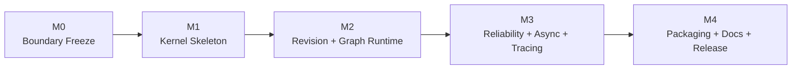
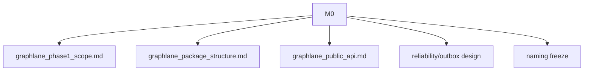
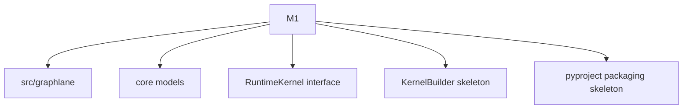
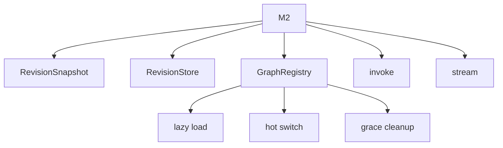
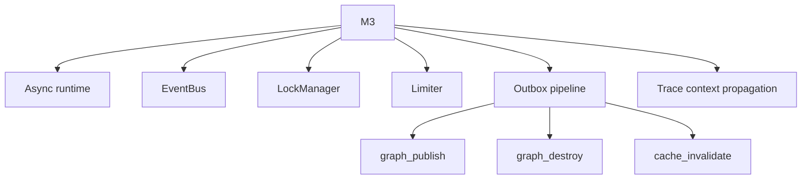
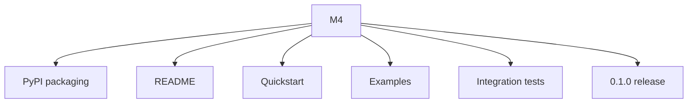
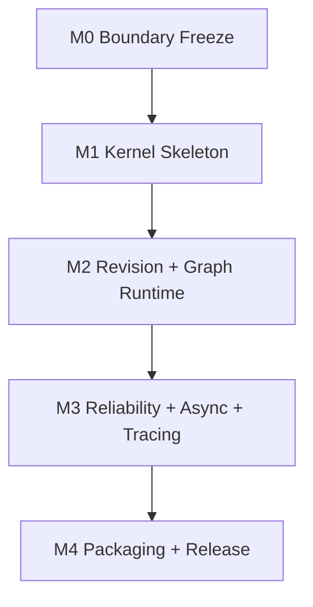
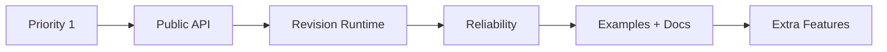
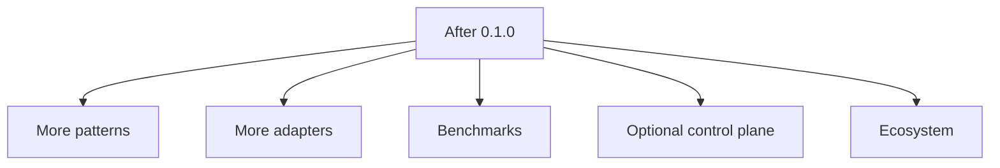

# Milestone Plan

这份文档把前面的路线图、范围、包结构和公共 API，收束成一个可执行的里程碑计划。

目标不是把所有事情都铺开，而是：

- 明确先后顺序
- 避免过早做产品层
- 让 PyPI 第一版尽快形成闭环

---

## 1. 总体节奏

建议按 5 个里程碑推进。

一句话概括：

- `M0` 定边界
- `M1` 起骨架
- `M2` 做 runtime 主链
- `M3` 补可靠性和可运维性
- `M4` 发 PyPI

---

## 2. M0: Boundary Freeze

### 2.1 目标

把“内核是什么，不是什么”彻底定住。

### 2.2 必须产出

- 一阶段范围文档
- 包结构文档
- 公共 API 文档
- reliability/outbox 专题文档
- 核心对象命名冻结

### 2.3 完成标准

- 你已经能用一句话说清定位
- 能清楚区分 runtime revision 和产品版本管理
- 能清楚区分 kernel / control plane / product / adapter
- 不再把 tenant、draft、template 混进 phase 1 核心

### 2.4 当前状态

- 已基本完成

---

## 3. M1: Kernel Skeleton

### 3.1 目标

把仓库和代码骨架搭起来，形成真正的 module 结构。

### 3.2 必须产出

- `src/graphlane/` 目录
- 顶层 `__init__.py`
- `api/`、`runtime/`、`revision/`、`graph/`、`side_effects/`、`adapters/` 等基础目录
- `pyproject.toml` 基础包信息
- 最小 `KernelBuilder`
- 核心 dataclass / pydantic model

### 3.3 这一阶段先不要做太深的东西

- 不急着把所有实现写满
- 不急着接 FastAPI
- 不急着接 Redis/Postgres 真实能力

这一阶段重点是：

- 让 module 结构成立
- 让 import 路径成立
- 让公共对象落地

### 3.4 完成标准

- `pip install -e .` 后可以正常 import
- README 里的最小 import 路径已经真实存在
- 核心对象和 builder 已有代码落点

---

## 4. M2: Revision + Graph Runtime

### 4.1 目标

做出 runtime kernel 的主闭环。

### 4.2 必须产出

- `AppSpec` revision snapshot 模型
- `RevisionStore` 协议
- `GraphRegistry`
- graph compile/load/switch
- active revision pointer
- lazy load
- old revision graceful cleanup
- `invoke`
- `stream`

### 4.3 这个阶段回答的核心问题

- 一个 app 如何被 revision 化
- 一个 revision 如何被发布为 active
- graph 如何被加载和切换
- turn 如何走同步/流式主链

### 4.4 明确边界

这一阶段里的 “publish” 只指：

- runtime revision publish

不是：

- draft 系统发布
- 产品 UI 版本发布

### 4.5 完成标准

- 可以发布 revision 1
- 可以 `invoke`
- 可以 `stream`
- 再发布 revision 2 后，新请求走 revision 2
- revision 1 上的旧请求仍能跑完

---

## 5. M3: Reliability + Async + Tracing

### 5.1 目标

把 kernel 从“能跑”提升到“可作为正式 runtime 使用”。

### 5.2 必须产出

- `submit_async`
- `subscribe_async`
- `EventBus`
- `LockManager`
- `Limiter`
- `SideEffectRecorder`
- `SideEffectExecutor`
- `OutboxStore`
- `OutboxWorker`
- trace context propagation
- graph publish/destroy/cache invalidate side effect pipeline

### 5.3 这个阶段回答的核心问题

- 异步 turn 怎么跑
- side effect 如何可靠执行
- 多实例 graph update 如何可靠传播
- 请求 trace 如何串到 worker 和 outbox

### 5.4 完成标准

- `submit_async` + `subscribe_async` 跑通
- outbox worker 重启后仍能恢复任务
- side effect 不再依赖“commit 后进程内 submit”
- trace 能跨请求与 worker 边界

---

## 6. M4: Packaging + Docs + Release

### 6.1 目标

把 kernel 真正变成一个能安装、能理解、能试用的 PyPI module。

### 6.2 必须产出

- 正式 `pyproject.toml`
- extras
- README
- Quickstart
- `examples/pure_python`
- `examples/fastapi_basic`
- integration tests
- release notes
- first tag / first publish

### 6.3 完成标准

- 新机器可 `pip install`
- example 跑通
- 公共 API 文档与代码一致
- 版本号可发布为 `0.1.0`

---

## 7. 里程碑依赖关系

这些里程碑最好不要乱序。

依赖逻辑：

- 没定 API，就不要急着抽代码
- 没有 revision runtime，就不要急着讲平台
- 没有 outbox 和 tracing，就不要急着对外承诺稳定 runtime
- 没有 examples 和 docs，就不要急着发 PyPI

---

## 8. 各里程碑的风险点

### 8.1 M1 风险

- 目录分层定得太虚
- 顶层 API 暴露太多
- 还没抽出公共对象就开始搬代码

### 8.2 M2 风险

- 把 runtime revision 和 draft/version 继续混在一起
- graph registry 仍强依赖现有 ORM 结构
- 过早支持多个 pattern

### 8.3 M3 风险

- outbox 只做了一半
- async path 和 sync path 语义不一致
- trace context 透传遗漏

### 8.4 M4 风险

- PyPI 包里混入过多产品依赖
- README 例子和真实 API 不一致
- 没有真实 integration tests 就发布

---

## 9. 建议的工作优先级

如果你每次只能做一点点，建议永远按这个优先级推进：

1. 稳定公共 API
2. 稳定 revision runtime
3. 稳定 outbox/reliability
4. 稳定 examples 和 docs
5. 最后才是额外能力

---

## 10. 第一版发布前的 Checklist

发布 `0.1.0` 前，建议至少全部满足：

- [ ] 顶层 API 已冻结
- [ ] `AppSpec` / `TurnRequest` / `TurnEvent` / `TurnResult` 已稳定
- [ ] `RuntimeKernel.invoke` / `stream` / `submit_async` / `subscribe_async` 已跑通
- [ ] revision publish / active switch 已跑通
- [ ] old revision graceful cleanup 已验证
- [ ] outbox side effect pipeline 已跑通
- [ ] trace context propagation 已跑通
- [ ] 最少一个 Redis/Postgres 官方组合实现已完成
- [ ] `examples/pure_python` 可跑
- [ ] `examples/fastapi_basic` 可跑
- [ ] integration tests 通过
- [ ] README/Quickstart 与真实代码一致

---

## 11. 里程碑完成后的下一阶段

`0.1.0` 发布后，再考虑这些：

- 更多 pattern
- SQLite 单机轻量方案
- 更丰富的 adapter
- 更细的 benchmark
- 更完整的 observability
- 可选 control plane

这些都应该放在 phase 1 之后。

---

## 12. 最终建议

一句话总结：

> 先把 `0.1.0` 当成“runtime kernel 成立”的节点，而不是“平台产品成立”的节点。

只要里程碑顺序守住，事情会容易很多：

- 先定边界
- 再立骨架
- 再做 revision runtime
- 再补可靠性和 tracing
- 最后打包发布

这条线是收敛的。
