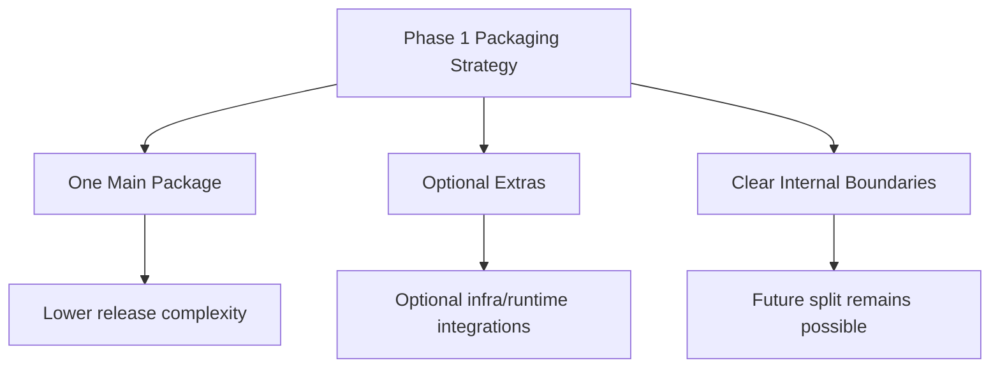
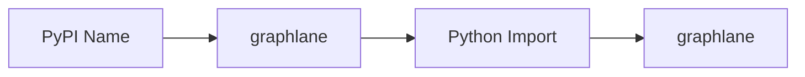
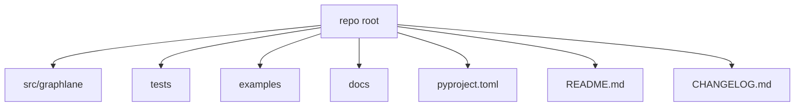
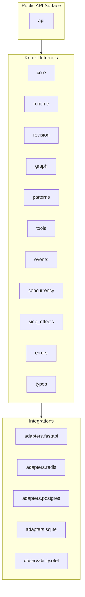
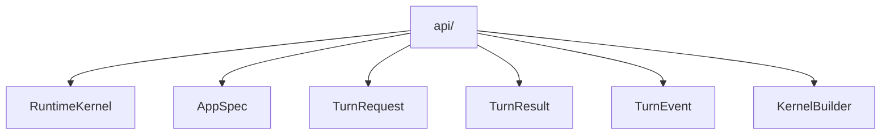
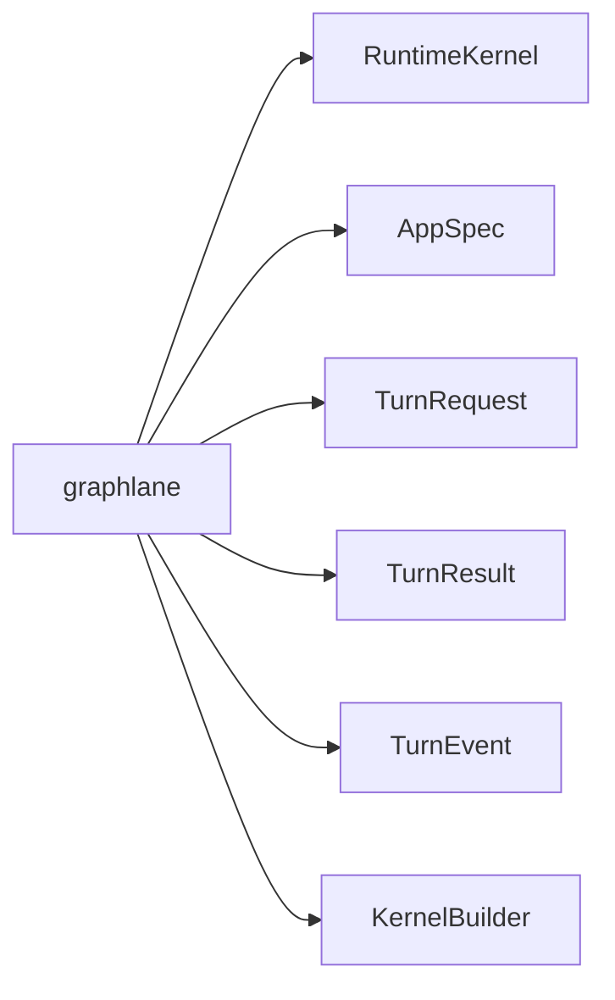
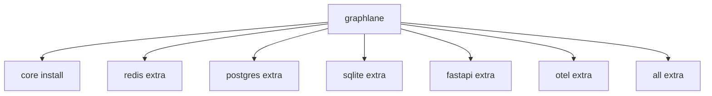
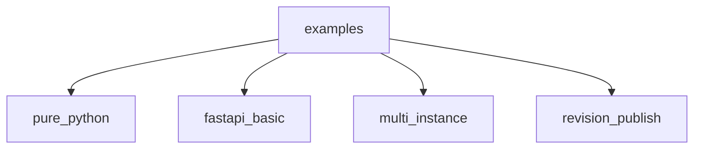
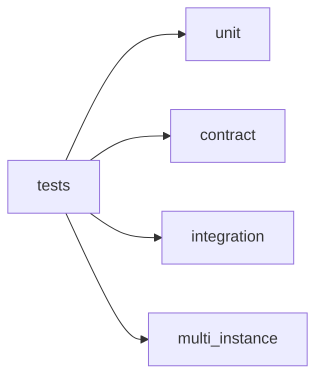
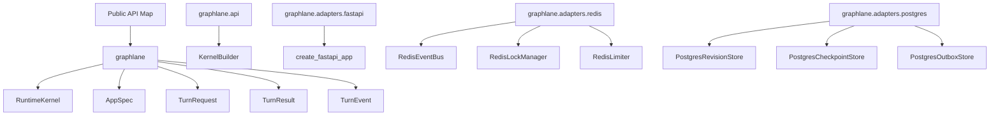

# Package Structure

这份文档定义 runtime kernel 第一版发布到 PyPI 时的包结构。

目标不是一次把生态做满，而是先得到一个：

- 可安装
- 可理解
- 公共 API 清晰
- 内部边界合理
- 后续可扩展

的 Python package。

---

## 1. 第一版发布策略

第一版建议：

- 先发布一个主包
- 用 `extras` 暴露可选适配能力
- 内部目录按内核/适配器/观测拆层

不建议一开始就拆成很多独立 PyPI 包。

原因：

- 认知负担太大
- 发布链路复杂
- 版本兼容管理更难
- 你现在最需要先稳定 API，而不是先做包矩阵



---

## 2. 推荐包名

主包名现在定为：

- PyPI 名：`graphlane`
- import 名：`graphlane`

这是当前正式选择。



---

## 3. 顶层目录建议

建议仓库顶层结构大致如下：



建议最终目录：

```text
repo/
  src/
    graphlane/
      __init__.py
      py.typed
      api/
      core/
      runtime/
      revision/
      graph/
      patterns/
      tools/
      events/
      concurrency/
      side_effects/
      adapters/
      observability/
      errors/
      types/
  tests/
  examples/
  docs/
  pyproject.toml
  README.md
  CHANGELOG.md
```

---

## 4. 包内部的分层

### 4.1 推荐分层图



### 4.2 分层原则

- `api/` 只放对外稳定入口
- `core/` 放最基础协议与对象
- `runtime/` 放 turn execution
- `revision/` 放 revision snapshot/store/publish 语义
- `graph/` 放 graph registry / compile / switch
- `patterns/` 放 pattern SPI 与参考实现
- `tools/` 放 tool executor 与 schema
- `events/` 放统一事件模型
- `concurrency/` 放 lock / limiter 协议
- `side_effects/` 放 outbox / executor / worker
- `adapters/` 放具体基础设施实现
- `observability/` 放 tracing/metrics 适配

---

## 5. 每个目录应该放什么

### 5.1 `api/`

这是最重要的目录，因为它定义公共表面。

建议内容：

- `kernel.py`
- `specs.py`
- `requests.py`
- `results.py`
- `events.py`
- `builders.py`

公共入口应尽量从这里导出。



### 5.2 `core/`

放基础协议和小型抽象，例如：

- protocol/interface
- shared constants
- base lifecycle abstractions
- common dataclasses

不要在这里放和 Redis/FastAPI/Postgres 强绑定的代码。

### 5.3 `runtime/`

放一次 turn 的核心执行流程：

- runtime engine
- stream adapter base contract
- invoke / stream / async submit semantics
- result finalization

这是整个 module 的心脏。

### 5.4 `revision/`

放 revision 相关抽象：

- `RevisionSnapshot`
- `RevisionStore`
- active revision pointer
- publish/reconcile semantics

注意：

- 这里是 runtime revision
- 不是 draft/version product system

### 5.5 `graph/`

放 graph runtime 控制面：

- `GraphRegistry`
- graph compile/load
- active/history graph slot
- hot switch
- graceful cleanup

### 5.6 `patterns/`

放 pattern SPI：

- `Pattern`
- `PatternRegistry`
- `react` 参考实现

第一版只建议内置 `react`。

### 5.7 `tools/`

放 tool 相关能力：

- tool schema
- tool binding
- tool executor abstraction
- sandbox execution contract

### 5.8 `events/`

放统一事件模型：

- turn events
- tool events
- lifecycle events
- async event stream contract

### 5.9 `concurrency/`

放并发控制协议：

- session lock interface
- limiter interface

### 5.10 `side_effects/`

放可靠性链路：

- `SideEffectTask`
- `SideEffectRecorder`
- `SideEffectExecutor`
- `OutboxWorker`
- retry/backoff policy

### 5.11 `adapters/`

放具体实现：

- `fastapi/`
- `redis/`
- `postgres/`
- `sqlite/`

### 5.12 `observability/`

放观测能力：

- tracing contract
- otel adapter
- log correlation helpers

### 5.13 `errors/`

放统一异常：

- configuration errors
- runtime execution errors
- revision errors
- concurrency errors

### 5.14 `types/`

放类型别名与 protocol helpers。

---

## 6. 建议的实际目录树

建议第一版可以先落成这样：

```text
src/graphlane/
  __init__.py
  py.typed
  api/
    __init__.py
    kernel.py
    specs.py
    requests.py
    results.py
    events.py
    builders.py
  core/
    __init__.py
    protocols.py
    lifecycle.py
    constants.py
  runtime/
    __init__.py
    engine.py
    stream.py
    async_runtime.py
    finalizer.py
  revision/
    __init__.py
    models.py
    store.py
    publish.py
  graph/
    __init__.py
    registry.py
    compiler.py
    slots.py
    cleanup.py
  patterns/
    __init__.py
    registry.py
    base.py
    react.py
  tools/
    __init__.py
    binding.py
    schema.py
    executor.py
    sandbox.py
  events/
    __init__.py
    turn.py
    tool.py
    bus.py
  concurrency/
    __init__.py
    locks.py
    limiter.py
  side_effects/
    __init__.py
    tasks.py
    recorder.py
    executor.py
    outbox.py
    worker.py
    retry.py
  adapters/
    __init__.py
    fastapi/
      __init__.py
      app.py
      routes.py
      sse.py
      deps.py
    redis/
      __init__.py
      event_bus.py
      locks.py
      limiter.py
      pubsub.py
    postgres/
      __init__.py
      revision_store.py
      checkpoint_store.py
      outbox_store.py
    sqlite/
      __init__.py
      revision_store.py
      checkpoint_store.py
  observability/
    __init__.py
    tracing.py
    otel.py
  errors/
    __init__.py
    runtime.py
    revision.py
    concurrency.py
    config.py
  types/
    __init__.py
    common.py
```

---

## 7. 顶层 `__init__.py` 应该暴露什么

顶层导出要非常克制。

建议只导出：

- `RuntimeKernel`
- `AppSpec`
- `TurnRequest`
- `TurnResult`
- `TurnEvent`
- `KernelBuilder`



不建议顶层直接导出：

- Redis 实现细节
- FastAPI route
- Postgres store 细节
- outbox worker 细节
- tracing 细节

这些应该从子模块导入。

---

## 8. 公共导入路径建议

建议长期承诺稳定的导入路径只有少数几类。

### 8.1 核心入口

```python
from graphlane import RuntimeKernel, AppSpec, TurnRequest
```

### 8.2 builder 入口

```python
from graphlane.api import KernelBuilder
```

### 8.3 adapter 入口

```python
from graphlane.adapters.redis import RedisEventBus
from graphlane.adapters.postgres import PostgresRevisionStore
from graphlane.adapters.fastapi import create_fastapi_app
```

### 8.4 observability 入口

```python
from graphlane.observability import setup_otel
```

### 8.5 不稳定内部路径

这些不应承诺长期稳定：

- `graphlane.runtime.engine`
- `graphlane.graph.slots`
- `graphlane.side_effects.worker`
- `graphlane.patterns.react`

它们可以存在，但 README 不应主推。

---

## 9. extras 设计建议

第一版建议这样设计：



建议 extras：

- `redis`
- `postgres`
- `sqlite`
- `fastapi`
- `otel`
- `all`

示意：

```toml
[project.optional-dependencies]
redis = ["redis>=7.0.0,<8.0.0"]
postgres = ["psycopg[binary,pool]>=3.0.0,<4.0.0", "asyncpg>=0.30.0,<0.33.0"]
sqlite = ["langgraph-checkpoint-sqlite>=3.0.0,<4.0.0"]
fastapi = ["fastapi>=0.120.0,<1.0.0", "uvicorn>=0.30.0,<1.0.0"]
otel = [
  "opentelemetry-api>=1.0.0,<2.0.0",
  "opentelemetry-sdk>=1.0.0,<2.0.0"
]
all = [
  "redis>=7.0.0,<8.0.0",
  "psycopg[binary,pool]>=3.0.0,<4.0.0",
  "asyncpg>=0.30.0,<0.33.0",
  "fastapi>=0.120.0,<1.0.0",
  "uvicorn>=0.30.0,<1.0.0",
  "opentelemetry-api>=1.0.0,<2.0.0",
  "opentelemetry-sdk>=1.0.0,<2.0.0"
]
```

---

## 10. 依赖策略建议

要把依赖面压小。

### 10.1 核心依赖应尽量少

主包基础依赖建议只保留：

- `langgraph`
- `langchain`
- `pydantic`
- 极少数必须的 typing/runtime 辅助库

### 10.2 重依赖走 extras

这些不要进主依赖：

- `fastapi`
- `redis`
- `psycopg`
- `asyncpg`
- `openpyxl`
- `apscheduler`
- 各类后台产品依赖

### 10.3 严格区分 build-time 和 runtime

不要把：

- `pytest`
- `black`
- `mypy`

放进主运行依赖。

---

## 11. examples 应该怎么组织

建议 `examples/` 最少有这几个：



推荐目录：

```text
examples/
  pure_python/
  fastapi_basic/
  multi_instance/
  revision_publish/
```

每个 example 都应该：

- 可以独立运行
- 有自己的 README
- 尽量少魔法

---

## 12. tests 应该怎么组织

建议测试按层次分开：

```text
tests/
  unit/
  contract/
  integration/
  multi_instance/
```



这样未来 PyPI 发布前的 CI 边界会比较清晰。

---

## 13. 文档结构建议

建议 `docs/` 下至少有：

```text
docs/
  architecture.md
  quickstart.md
  graphlane_public_api.md
  adapters.md
  revision_model.md
  side_effects.md
  observability.md
```

README 只做总览，不要把所有细节都塞进去。

---

## 14. 第一版推荐的公共对象位置

建议最终公共对象放置如下：



---

## 15. 版本策略建议

第一版既然要上 PyPI，就要明确版本承诺。

建议：

- 第一版发 `0.1.0`
- 在 `0.x` 阶段明确说明：
  - 公共 API 仍可能调整
  - 但会尽量保证 README 中主路径稳定

不要一上来发 `1.0.0`。

---

## 16. 最终建议

一句话总结：

> 第一版先做一个主包 `graphlane`，内部按内核/适配器/观测分层，外部只暴露极少量稳定入口，其余能力通过子模块和 extras 提供。

最关键的几条原则：

- 顶层导出克制
- 重依赖走 extras
- 内部先分层，再考虑未来拆多包
- 公共 API 少而稳
- 不把当前业务项目的概念直接带进包结构

如果包结构按这份文档落，后面你无论是继续单包演进，还是拆成多个 PyPI 子包，路径都会顺很多。
