# Phase 1 Scope

这份文档定义 runtime kernel 第一阶段的明确边界。

目标不是“做完整平台”，而是：

> 做出一个最小但完整、可发布到 PyPI、可被外部 Python 项目实际使用的 Graphlane Runtime Kernel。

这份 scope 主要回答三个问题：

1. 第一阶段必须完成什么
2. 第一阶段明确不做什么
3. 第一阶段里“版本快照”到底指什么

---

## 1. 一阶段目标

第一阶段的目标不是控制台，不是后台，不是多租户产品，而是：

- 稳定的内核抽象
- 可运行的 revision-based runtime
- 可验证的异步/热更新/观测闭环
- 最小 PyPI module 形态

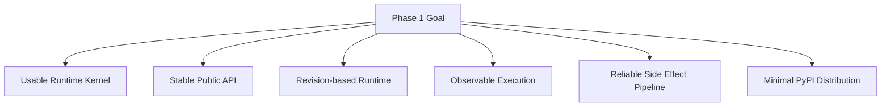

一句话定义：

> Phase 1 是“运行时内核成立”的阶段，不是“平台产品成立”的阶段。

---

## 2. 一阶段必须包含的能力

### 2.1 Turn Execution Runtime

必须有：

- 同步执行 `invoke`
- 流式执行 `stream`
- 异步提交 `submit_async`
- 异步订阅 `subscribe_async`
- 统一事件模型
- tool call 事件输出
- assistant 输出与最终结果归并

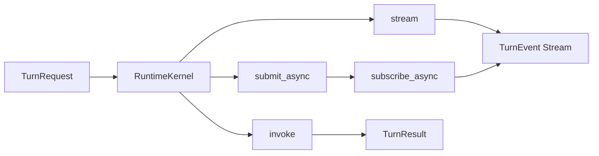

### 2.2 Graph Registry

必须有：

- `get_graph(app_id)`
- active revision 缓存
- lazy load
- hot switch
- 旧 revision 延迟回收
- 多实例广播消费

这部分本质上是你现在 `GraphManager` 的抽象化版本。

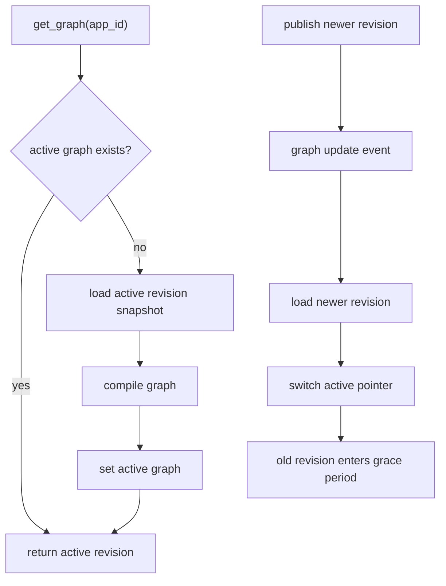

### 2.3 Runtime Revision Snapshot

必须有：

- `AppSpec` 在某个 revision 下的完整快照
- active revision 指针
- publish 新 revision
- 根据 revision 加载 graph
- old revision graceful draining

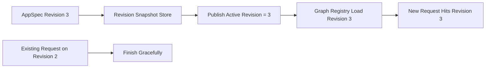

### 2.4 Checkpoint Store

必须有：

- thread 级状态持久化接口
- 至少一个官方实现
  - `postgres` 或 `sqlite`

这是 runtime 成立的基础能力之一。

### 2.5 Event Bus

必须有：

- turn 级事件发布
- turn 级订阅
- 至少一个官方实现
  - 推荐 `redis`

### 2.6 Lock / Limiter

必须有：

- session-level execution lock
- global limiter
- 至少一个分布式实现

如果没有这两个东西，runtime 的执行语义不稳定。

### 2.7 Side Effect Reliability

必须有：

- side effect task schema
- `outbox` 记录
- worker 消费
- retry / backoff
- `graph_publish`
- `graph_destroy`
- `cache_invalidate`

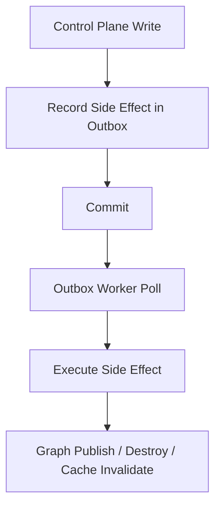

### 2.8 Tracing / Observability

必须有：

- turn span
- model round span
- tool call span
- graph load / build / switch span
- outbox worker trace context 透传
- async turn worker trace context 透传

这不是锦上添花，是 kernel 可运维性的组成部分。

### 2.9 Public API 与 Packaging

必须有：

- 清晰的公共导入路径
- 最小 `pyproject.toml`
- 可选 extras
- 最小示例
- 基础文档

建议第一阶段至少提供：

- `core`
- `redis`
- `postgres`
- `fastapi`
- `otel`

---

## 3. 一阶段的核心对象

第一阶段建议稳定下来的公共对象：

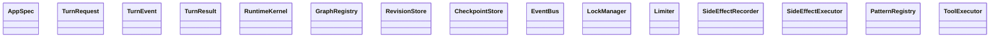

这些对象是第一阶段真正要打磨的“公共表面”。

---

## 4. 一阶段明确不做的内容

### 4.1 不做产品层功能

不做：

- 多租户
- RBAC
- 登录/SSO/验证码
- 后台管理系统
- 菜单权限系统
- 运营报表

### 4.2 不做重控制面产品体验

不做：

- draft 编辑器体系
- publish history 页面
- compare/restore UI
- 模板市场
- 应用商城式能力

### 4.3 不做过度生态承诺

不做：

- 一次支持很多 pattern
- 一次支持所有模型 provider
- 一次支持很多 web 框架
- 一次支持复杂插件市场

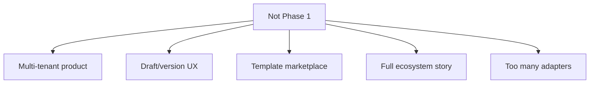

---

## 5. 一阶段“版本快照”到底包含什么

这是最关键的边界问题。

### 5.1 一阶段必须包含的版本快照

必须包含的是：

> runtime revision snapshot

它表示：

- 某个 `AppSpec` 在 revision `N` 时的完整运行时配置
- 可以被 graph registry 读取
- 可以被发布为 active revision
- 可以支持新旧 revision 并存一段时间

它的核心目的是：

- 运行时一致性
- revision 切换
- graph 复现
- deployment 控制

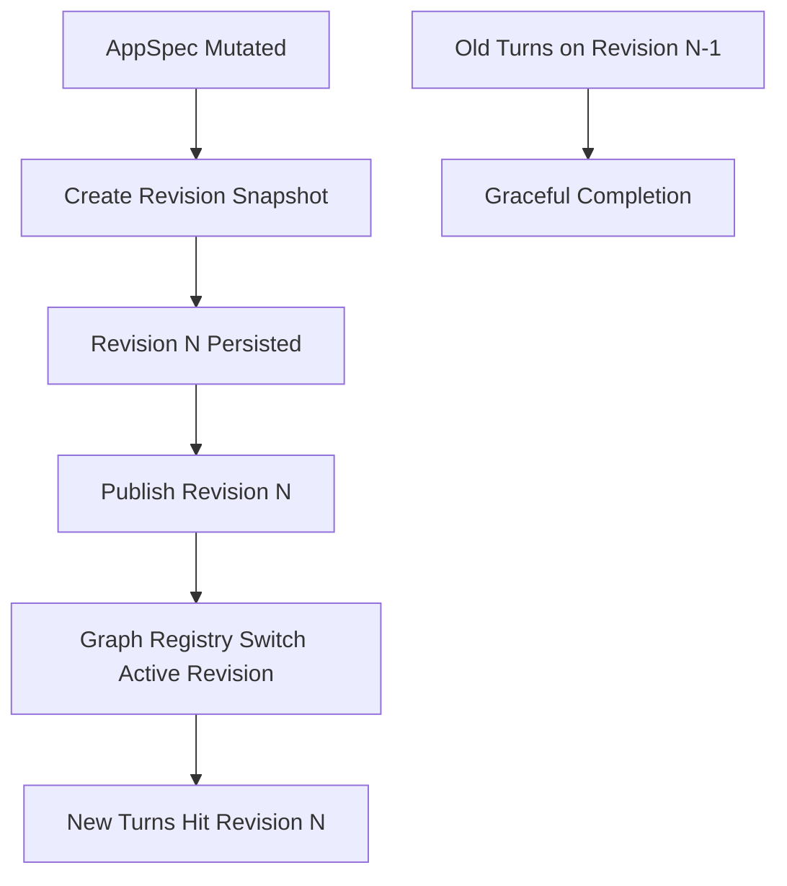

### 5.2 一阶段不包含的版本快照

不包含的是：

- draft snapshot
- publish history UI
- restore workflow
- user-facing version compare
- product-level save points

这些都属于 control plane 或 product plane。

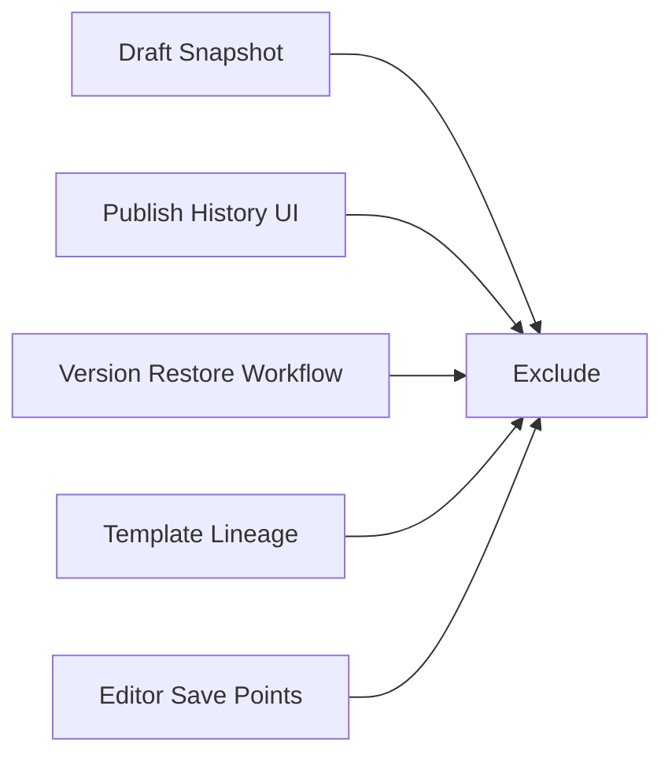

### 5.3 一句话区分

你可以这样记：

- 一阶段做的是“runtime revision”
- 不是“版本管理产品”

---

## 6. 一阶段最小官方实现建议

为了能真正发到 PyPI 并让别人跑起来，第一阶段建议只维护最小官方组合。

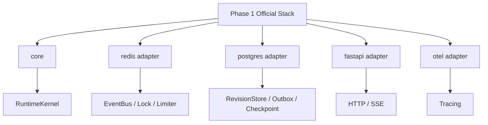

建议第一阶段不要官方维护太多变体。

最稳的组合是：

- core
- redis
- postgres
- fastapi
- otel

如果你想降低复杂度，也可以在第一阶段做一个更小版本：

- `sqlite + local queue + pure python`

但那样多实例语义会明显弱很多。

---

## 7. 一阶段测试要求

一阶段要能发 PyPI，测试不能只靠 fake/mock。

至少要有：

- unit tests
- contract tests
- integration tests
- multi-instance tests
- concurrency tests

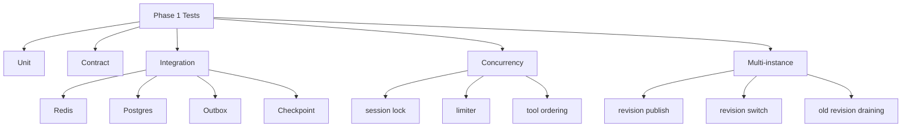

至少应覆盖这些 case：

- sync turn 执行成功
- stream turn 持续产出事件
- async submit + subscribe 完整链路
- publish revision 后新请求命中新版
- 旧 revision 在 grace period 内仍能跑完
- outbox worker 重启后仍能恢复 side effect
- trace context 能从请求传到 worker

---

## 8. 一阶段交付物

第一阶段结束时，应该至少有这些交付物：

1. 一个可安装的 PyPI module
2. 一套稳定公共 API
3. 一个最小 FastAPI demo
4. 一个 pure Python demo
5. 一套 integration tests
6. 一份 architecture 文档
7. 一份 extension guide

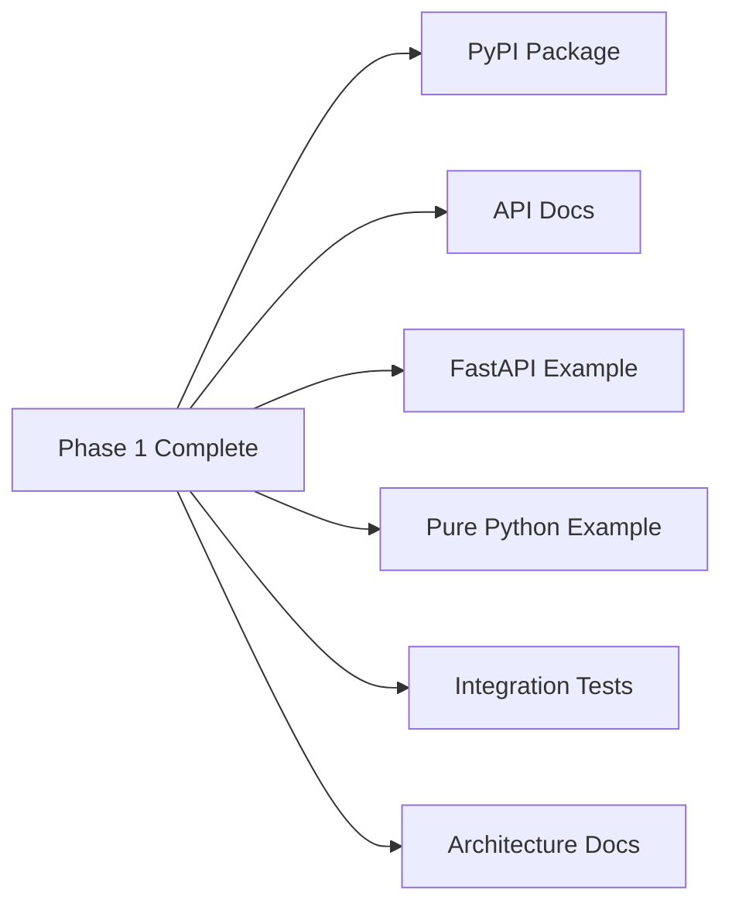

---

## 9. 一阶段完成的判断标准

满足下面这些条件，才算第一阶段真正完成：

- 离开当前业务项目，也能独立运行
- 不依赖租户/RBAC/后台模型
- 支持 revision-based graph runtime
- 支持 sync/stream/async 三种执行路径
- 支持多实例 revision 切换
- 支持 outbox-based reliable side effect pipeline
- 支持最小 tracing 闭环
- 可以通过 PyPI 安装并跑通 example

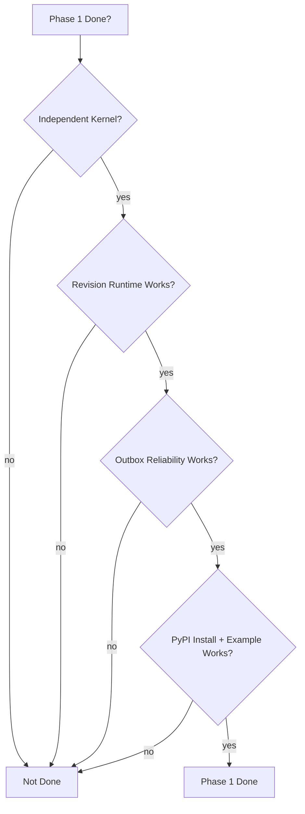

---

## 10. 最终结论

第一阶段不是做大，而是做准。

最核心的一句话是：

> 第一阶段要完成的是“一个带 revision、热切换、异步事件、可靠 side effect 和 tracing 的 LangGraph runtime kernel”。

不是：

- 一个完整平台
- 一个控制台
- 一个多租户系统
- 一个 draft/template/version 产品

如果边界按这份文档守住，第一阶段就是对的。
