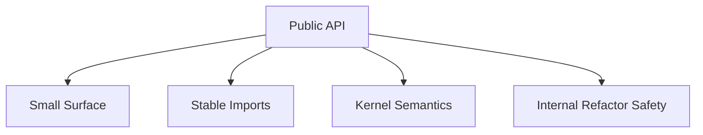
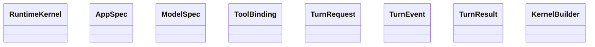
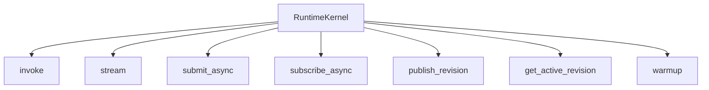
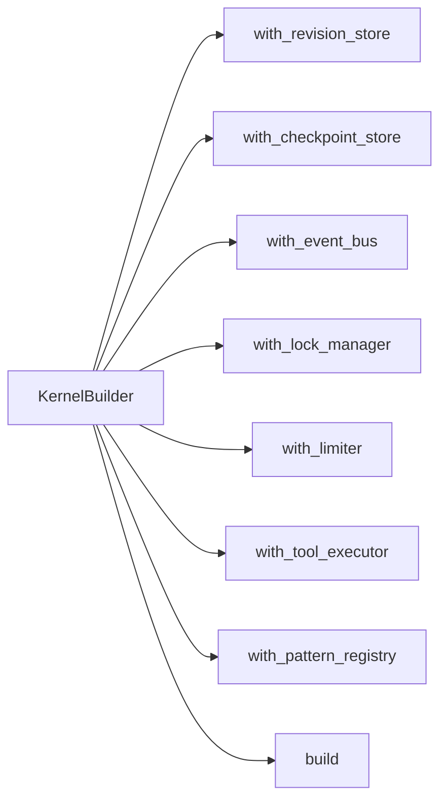
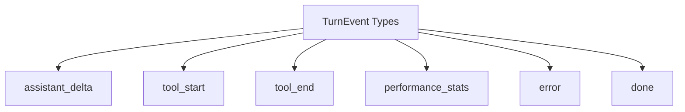
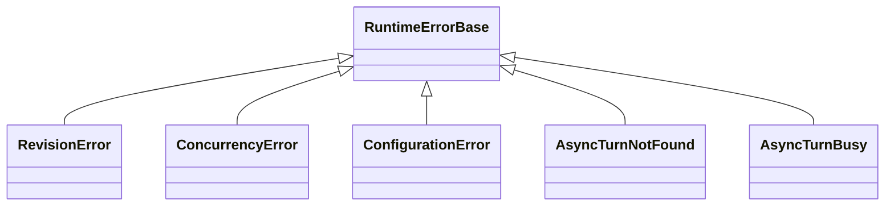
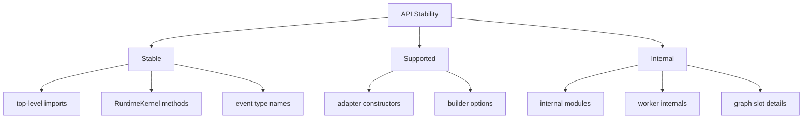

# Public API

这份文档定义 `graphlane` 第一版准备对外承诺的公共 API。

目标不是把内部所有能力都暴露出来，而是：

- 暴露最少但足够有用的对象
- 让外部用户能稳定依赖
- 把内部重构空间保留下来

一句话原则：

> 第一版只承诺“运行时内核的公共表面”，不承诺内部实现细节。

---

## 1. 公共 API 设计原则

第一版公共 API 应满足：

1. 足够小
2. 足够稳定
3. 足够表达核心语义
4. 不泄露内部结构



不应该发生的事情：

- 用户必须 import 内部模块才能完成基本使用
- 用户必须知道 graph slot/history wrapper 等内部结构
- 用户必须依赖某个 Redis/Postgres 细节才能写核心逻辑

---

## 2. 第一版对外承诺的对象

第一版建议正式承诺的对象只有这些：

- `RuntimeKernel`
- `AppSpec`
- `ModelSpec`
- `ToolBinding`
- `TurnRequest`
- `TurnEvent`
- `TurnResult`
- `KernelBuilder`



---

## 3. 顶层导入路径

顶层建议只提供这些：

```python
from graphlane import (
    RuntimeKernel,
    AppSpec,
    ModelSpec,
    ToolBinding,
    TurnRequest,
    TurnEvent,
    TurnResult,
)
```

builder 建议单独从 `api` 导入：

```python
from graphlane.api import KernelBuilder
```

这两组路径应该是 README 主推路径。

---

## 4. 核心对象定义建议

### 4.1 `AppSpec`

职责：

- 描述某个 runtime app 在某个 revision 下的完整运行时配置

建议字段：

```python
class AppSpec(BaseModel):
    app_id: str
    name: str
    revision: int
    app_type: str
    enabled_patterns: list[str] = []
    prompt: str | None = None
    model: ModelSpec
    tools: list[ToolBinding] = []
    runtime_options: dict[str, Any] = {}
```

说明：

- 这是 runtime 配置对象
- 不是 ORM model
- 不带 tenant、RBAC、UI 字段

### 4.2 `ModelSpec`

职责：

- 描述模型运行时装配所需的最小信息

建议字段：

```python
class ModelSpec(BaseModel):
    provider: str
    model: str
    model_args: dict[str, Any] = {}
    model_kwargs: dict[str, Any] = {}
```

### 4.3 `ToolBinding`

职责：

- 描述一个工具如何被 runtime 挂载

建议字段：

```python
class ToolBinding(BaseModel):
    tool_id: str
    name: str
    description: str
    source: str | None = None
    schema: dict[str, Any] | None = None
    hidden_kwargs: dict[str, Any] = {}
```

注意：

- 第一版不一定要把工具系统完全产品化
- 但 `ToolBinding` 这个语义应该先稳定下来

### 4.4 `TurnRequest`

职责：

- 描述一次 turn 执行输入

建议字段：

```python
class TurnRequest(BaseModel):
    app_id: str
    session_id: str
    turn_id: str | None = None
    query: str
    input: dict[str, Any] = {}
    metadata: dict[str, Any] = {}
    traceparent: str | None = None
```

### 4.5 `TurnEvent`

职责：

- runtime 在执行期间产出的统一事件

建议字段：

```python
class TurnEvent(BaseModel):
    type: str
    payload: dict[str, Any] = {}
    timestamp: float
```

第一版建议至少稳定这些事件类型：

- `assistant_delta`
- `tool_start`
- `tool_end`
- `performance_stats`
- `error`
- `done`

### 4.6 `TurnResult`

职责：

- 一次 turn 的最终归并结果

建议字段：

```python
class TurnResult(BaseModel):
    turn_id: str
    session_id: str
    assistant_content: str = ""
    finish_reason: str | None = None
    tool_records: list[dict[str, Any]] = []
    metrics: dict[str, Any] = {}
    error_message: str | None = None
```

---

## 5. `RuntimeKernel` 应承诺什么方法

这是最重要的对象。

第一版建议 `RuntimeKernel` 只承诺这几类方法。



建议接口形态：

```python
class RuntimeKernel(Protocol):
    async def invoke(self, request: TurnRequest) -> TurnResult: ...

    async def stream(self, request: TurnRequest) -> AsyncIterator[TurnEvent]: ...

    async def submit_async(self, request: TurnRequest) -> str: ...

    async def subscribe_async(self, turn_id: str) -> AsyncIterator[TurnEvent]: ...

    async def publish_revision(self, spec: AppSpec) -> int: ...

    async def get_active_revision(self, app_id: str) -> int | None: ...

    async def warmup(self, app_id: str) -> None: ...
```

### 5.1 `invoke`

语义：

- 执行一次完整 turn
- 返回最终 `TurnResult`
- 不要求调用方处理事件流

### 5.2 `stream`

语义：

- 执行一次 turn
- 持续产出 `TurnEvent`
- 允许外部自行适配成 SSE / websocket / CLI output

### 5.3 `submit_async`

语义：

- 提交一次异步执行
- 返回 `turn_id`

### 5.4 `subscribe_async`

语义：

- 订阅 `turn_id` 对应的执行事件
- 不要求一定是 SSE
- 这是内核级订阅，不是 HTTP 协议承诺

### 5.5 `publish_revision`

语义：

- 写入一个新的 runtime revision snapshot
- 把它推进为 active revision
- 触发后续 side effect pipeline

注意：

- 这是 runtime revision publish
- 不是 draft 系统里的 publish UX

### 5.6 `get_active_revision`

语义：

- 返回当前 active revision

### 5.7 `warmup`

语义：

- 提前加载/编译 graph
- 不是必须方法，但很实用

---

## 6. `KernelBuilder` 应承诺什么

第一版建议 builder 模式负责依赖装配。



建议接口形态：

```python
class KernelBuilder:
    def with_revision_store(self, store: RevisionStore) -> Self: ...
    def with_checkpoint_store(self, store: CheckpointStore) -> Self: ...
    def with_event_bus(self, bus: EventBus) -> Self: ...
    def with_lock_manager(self, manager: LockManager) -> Self: ...
    def with_limiter(self, limiter: Limiter) -> Self: ...
    def with_tool_executor(self, executor: ToolExecutor) -> Self: ...
    def with_pattern_registry(self, registry: PatternRegistry) -> Self: ...
    def build(self) -> RuntimeKernel: ...
```

这能让第一版用户很自然地装配不同 adapter。

---

## 7. Adapter 层建议暴露哪些 API

### 7.1 FastAPI adapter

建议公开：

```python
from graphlane.adapters.fastapi import create_fastapi_app
```

或：

```python
from graphlane.adapters.fastapi import mount_runtime_routes
```

不要一开始暴露太多 route 内部细节。

### 7.2 Redis adapter

建议公开：

```python
from graphlane.adapters.redis import (
    RedisEventBus,
    RedisLockManager,
    RedisLimiter,
)
```

### 7.3 Postgres adapter

建议公开：

```python
from graphlane.adapters.postgres import (
    PostgresRevisionStore,
    PostgresCheckpointStore,
    PostgresOutboxStore,
)
```

### 7.4 OTel adapter

建议公开：

```python
from graphlane.observability import setup_otel
```

---

## 8. 第一版建议稳定的事件类型

第一版建议正式承诺这些事件类型名称，不要频繁改名。



### 8.1 `assistant_delta`

表示：

- assistant 文本增量输出

### 8.2 `tool_start`

表示：

- 某次工具调用开始

### 8.3 `tool_end`

表示：

- 某次工具调用结束

### 8.4 `performance_stats`

表示：

- 一次 turn 的性能汇总

### 8.5 `error`

表示：

- 执行中发生异常

### 8.6 `done`

表示：

- 事件流结束

---

## 9. 第一版不建议承诺的 API

下面这些能力第一版可以实现，但不建议作为正式稳定 API 对外承诺。

### 9.1 内部 graph 结构

不承诺：

- graph slot 对象
- compiled graph wrapper
- history graph container
- registry 内部缓存结构

### 9.2 内部 worker 结构

不承诺：

- outbox worker 内部轮询方法
- async worker 内部队列实现
- retry 策略内部函数名

### 9.3 内部 tracing 名称细节

不承诺：

- 所有 span 名称永远不变
- 所有 attribute key 永远不变

可以承诺：

- 有 turn/graph/tool/worker tracing 能力

### 9.4 内部 `react` pattern 实现细节

不承诺：

- `react` pattern 内部节点函数名
- 内部 orchestration 图结构完全不变

---

## 10. 异常模型建议

第一版建议对外暴露少量统一异常，而不是把底层异常直接漏出去。

建议类型：

- `RuntimeErrorBase`
- `RevisionError`
- `ConcurrencyError`
- `ConfigurationError`
- `AsyncTurnNotFound`
- `AsyncTurnBusy`



这样 HTTP adapter 可以更容易做状态码映射，但内核本身不依赖 HTTP。

---

## 11. 一个最小使用示例应长什么样

第一版 README 至少应支持这种使用方式：

```python
from graphlane import AppSpec, ModelSpec, TurnRequest
from graphlane.api import KernelBuilder
from graphlane.adapters.redis import RedisEventBus, RedisLockManager, RedisLimiter
from graphlane.adapters.postgres import (
    PostgresRevisionStore,
    PostgresCheckpointStore,
    PostgresOutboxStore,
)

builder = KernelBuilder()
kernel = (
    builder
    .with_revision_store(PostgresRevisionStore(...))
    .with_checkpoint_store(PostgresCheckpointStore(...))
    .with_event_bus(RedisEventBus(...))
    .with_lock_manager(RedisLockManager(...))
    .with_limiter(RedisLimiter(...))
    .build()
)

await kernel.publish_revision(
    AppSpec(
        app_id="demo",
        name="demo",
        revision=1,
        app_type="REACT",
        enabled_patterns=["REACT"],
        model=ModelSpec(provider="openai", model="gpt-4.1"),
    )
)

result = await kernel.invoke(
    TurnRequest(
        app_id="demo",
        session_id="s1",
        query="hello",
    )
)
```

如果这个例子都跑不通，那公共 API 就还没定好。

---

## 12. README 主叙事建议

README 第一屏应该围绕这些 API 叙事：

1. `publish_revision`
2. `invoke`
3. `stream`
4. `submit_async`
5. `subscribe_async`

而不是先讲：

- 内部 graph slot
- 工具沙箱内部原理
- 多租户控制台能力

---

## 13. 稳定性分级建议

第一版建议在文档中显式标注三层稳定性。



定义建议：

- `Stable`
  - README 主推入口
  - 会尽量保持兼容
- `Supported`
  - 可用，但可能会小幅调整
- `Internal`
  - 不承诺兼容

---

## 14. 最终建议

一句话总结：

> 第一版公共 API 应该围绕 `AppSpec -> publish_revision -> invoke/stream/async -> TurnEvent/TurnResult` 这条最小主链展开。

真正该稳定下来的只有：

- 核心对象
- 核心方法
- 核心事件类型
- 核心导入路径

不该在第一版就稳定下来的，是所有内部实现细节。

如果公共 API 能按这份文档守住，后面你内部无论怎么重构 graph registry、outbox worker、adapter 细节，都还有足够空间。
