# Graphlane Runtime Kernel Open Source Roadmap

这份文档面向“将当前项目抽象成平台级 LangGraph 运行时内核”的开源规划。

目标不是继续堆业务能力，而是把现有系统拆成：

- 可复用的运行时内核
- 可替换的基础设施适配层
- 可选的控制面与产品层

当前判断：

- 你已经有了 runtime kernel 的雏形
- 但还没有完成“平台级抽象”的边界收敛
- 下一阶段的核心工作应该是“抽象冻结、组件解耦、可靠性补强、集成验证”

配套专题：

- `graphlane_side_effect_reliability_plan.md` 现在应视为本路线图的“可靠性与 side effect pipeline 专题延伸”，不再承担“现有业务项目迁移方案”的角色

---

## 1. 产品定位

一句话定位：

> 一个基于 LangGraph 的 Python Agent Runtime Kernel，负责执行、切换、观测、持久化与多实例一致性，不绑定具体业务系统。

它不应该再被表述为：

- 一个完整后台管理系统
- 一个多租户 SaaS 成品
- 一个面向某个行业场景的 Agent 应用

它更接近：

- Agent Runtime Kernel
- Agent Control Plane 基础设施
  - 面向 Python 框架的执行层中间件

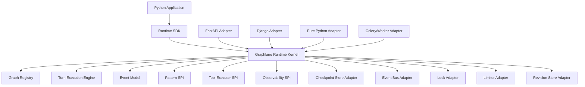

---

## 2. 当前系统在开源版里的真实价值

最值得保留并抽象成开源核心的部分：

- 统一 turn execution runtime
- graph version 与热切换机制
- 多入口复用同一执行主链
- 工具动态装配与隐藏参数注入
- session lock / global limiter
- async turn event bus
- 结构化 tracing
- preview 与正式发布的分离语义

不应该作为第一优先级核心卖点的部分：

- 租户、用户、角色、菜单、函数权限
- 登录、SSO、验证码
- 后台管理风格 API
- 模板市场式能力
- Excel 导出、统计后台

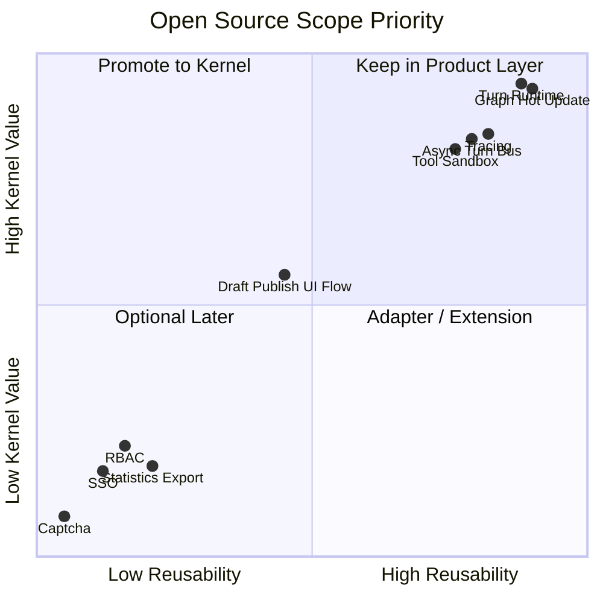

---

## 3. 开源版目标架构

建议把最终仓库拆成 4 层。

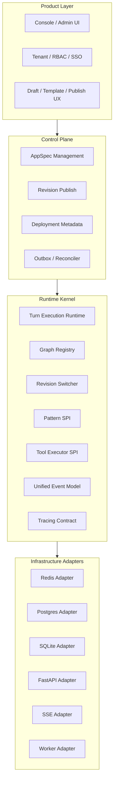

设计原则：

- `Kernel` 不依赖 FastAPI
- `Kernel` 不依赖多租户模型
- `Kernel` 不依赖具体 ORM 表结构
- `Infra Adapter` 可以替换
- `Control Plane` 只负责“声明式配置到 revision”的管理

---

## 4. 应先冻结的核心协议

你下一步最重要的不是加功能，而是定协议。

### 4.1 Runtime Core 协议

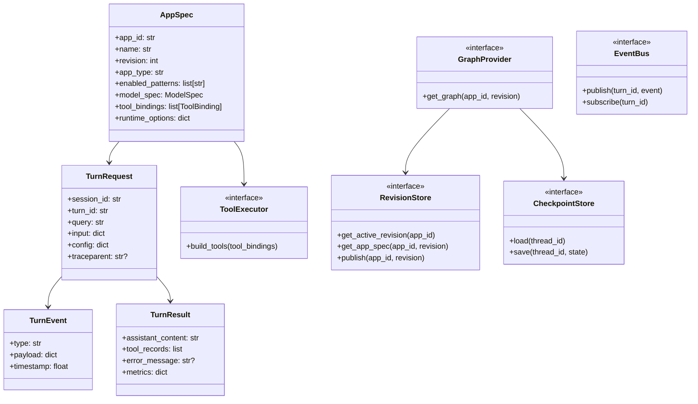

### 4.2 Pattern SPI 协议

你现在的运行时其实已经暗含一个 pattern 扩展点，但只有 `REACT` 真正落地。

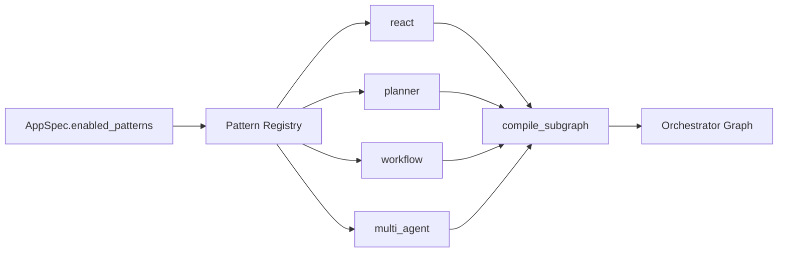

建议第一版只保留：

- `react` 参考实现

但接口必须预留：

- `compile_pattern_subgraph(pattern_name, context) -> CompiledSubgraph`

否则之后每加一个模式都要改核心。

---

## 5. 推荐的仓库/包拆分方案

建议不要继续把所有东西放在一个 `app/` 下作为开源主体。

```mermaid
flowchart TD
    A[mono repo or org repo] --> B[runtime-core]
    A --> C[runtime-adapter-fastapi]
    A --> D[runtime-adapter-redis-postgres]
    A --> E[runtime-observability-otel]
    A --> F[examples]
    A --> G[product-console optional]

    B --> B1[execution]
    B --> B2[graph_registry]
    B --> B3[pattern_spi]
    B --> B4[event_model]
    B --> B5[tool_spi]

    C --> C1[http routes]
    C --> C2[sse adapter]
    C --> C3[auth hooks]

    D --> D1[revision store]
    D --> D2[checkpoint store]
    D --> D3[redis event bus]
    D --> D4[distributed lock]
    D --> D5[global limiter]
    D --> D6[outbox worker]

    E --> E1[otel tracing]
    E --> E2[metrics]
    E --> E3[log correlation]

    F --> F1[pure python]
    F --> F2[fastapi]
    F --> F3[multi instance]
```

建议的最小开源包名：

- `graphlane`
- `graphlane-fastapi`
- `graphlane-redis-postgres`
- `graphlane-otel`

---

## 6. v0.1 应该完成什么

v0.1 目标不是“功能全”，而是“边界稳定、能跑、能扩展、能观测”。

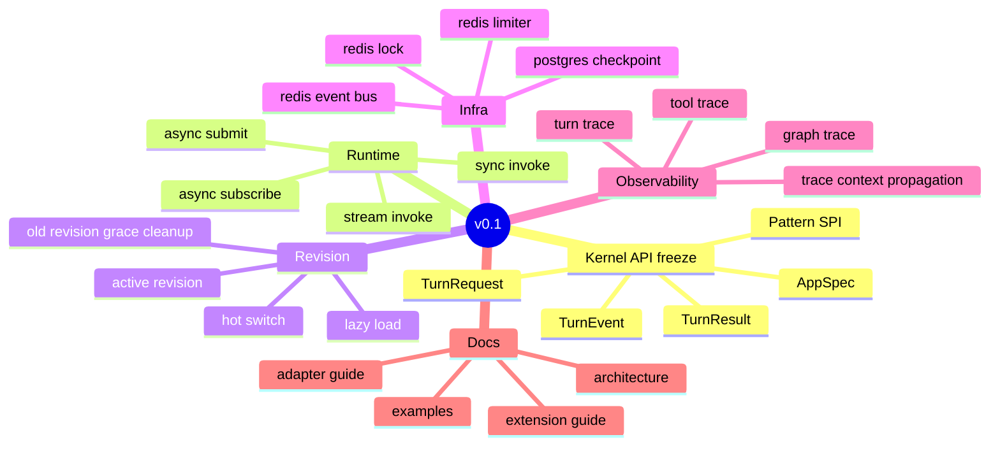

v0.1 必做项：

1. 把 `kernel` 从 FastAPI API 层解耦
2. 把 `AgentApp` ORM 结构抽象成 `AppSpec`
3. 引入 `transactional outbox`
4. 为 async turn 和 post-commit 透传 trace context
5. 补真正的 integration tests
6. 提供一个最小 FastAPI example

### 6.1 v0.1 的功能边界

这里最容易混淆的是：

- `GraphManager` / graph registry
- runtime revision
- draft/version history

它们不是一回事。

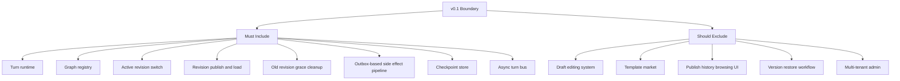

### 6.2 v0.1 应包含哪种“版本快照”

v0.1 应该包含的是：

- `runtime revision snapshot`

也就是：

- 某个 `AppSpec` 在某个 revision 下的完整运行时配置快照
- 可以被发布为 active revision
- 可以被 graph registry 加载、缓存、切换
- 可以让新请求命中新版、旧请求继续跑旧版

这类 snapshot 的作用是运行时一致性，不是产品化的版本管理界面。

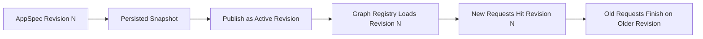

### 6.3 v0.1 不应包含哪种“版本快照”

v0.1 不建议包含的是：

- `draft snapshot`
- `publish history UI`
- `restore version workflow`
- `template-derived version lineage`

这些已经属于 control plane / product plane。

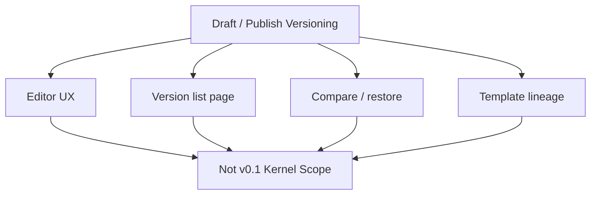

### 6.4 一句话边界

可以这样记：

- v0.1 要做“运行时 revision”
- v0.1 不做“产品化版本管理系统”

v0.1 不建议做的事：

- 多 pattern 一次做齐
- 复杂控制台
- 模板市场
- 多 provider 全量兼容承诺
- 太重的插件生态故事

---

## 7. v0.2 再做什么

v0.2 才适合扩展“平台能力”。

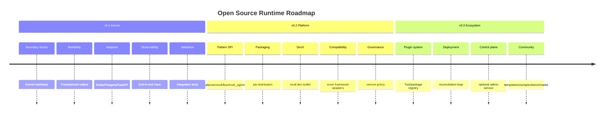

v0.2 值得做：

- pattern registry
- adapter registry
- dev server / local runner
- sqlite 单机适配
- 更明确的 provider abstraction
- benchmark 和兼容性矩阵

---

## 8. 当前最优先的技术债

### 8.1 Outbox

这是最先要补的。

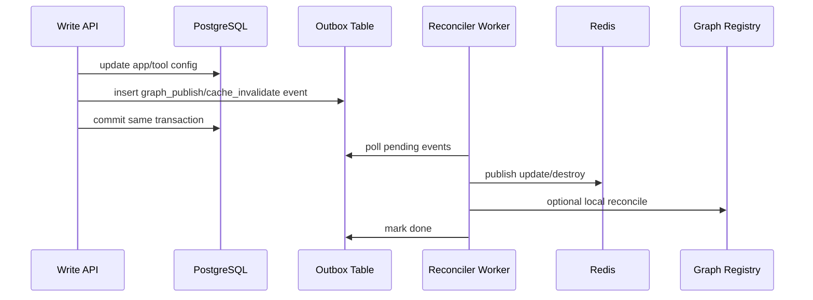

没有这个能力，平台级可信度不够。

### 8.2 Trace Context Propagation

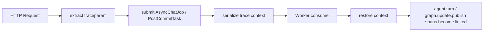

### 8.3 Core 与 Product 解耦

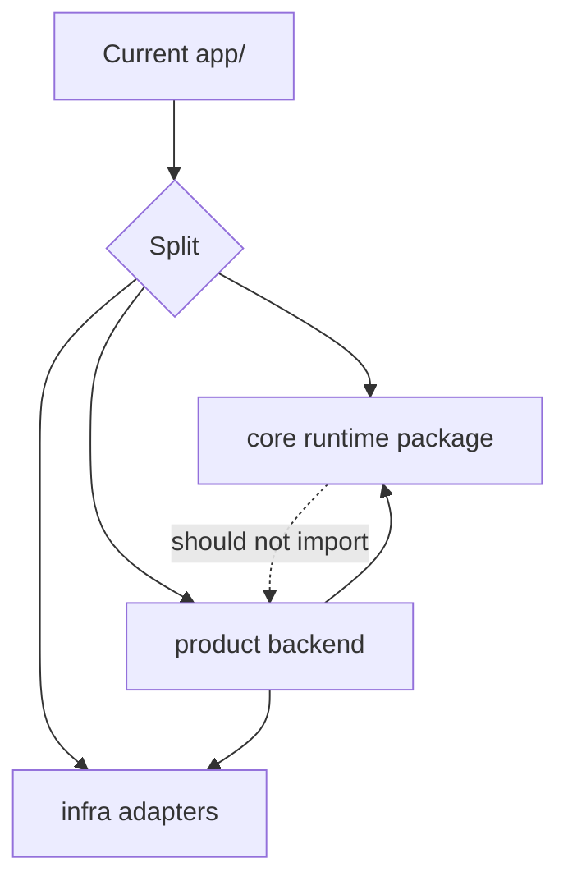

---

## 9. 测试矩阵应该怎么补

你现在的 fake/mock 契约测试可以保留，但开源前必须增加真实基础设施验证。

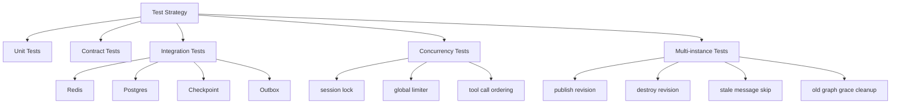

最少应补这些 case：

- 单 turn sync stream 成功链路
- async submit + subscribe 完整链路
- publish 新 revision 后新请求命中新版、旧请求继续跑旧版
- delete/destroy 后所有实例本地 graph 清理
- outbox 在 worker 重启后仍可恢复执行
- trace context 从 HTTP 到 worker 连通

---

## 10. 你对外该怎么讲

建议外部表述：

> 这是一个基于 LangGraph 的运行时内核，不替代 LangGraph，而是为 LangGraph 提供平台级执行、版本切换、异步任务、可观测性和多实例一致性能力。

不建议外部表述：

> 我做了一个比 LangGraph 更底层的框架

因为别人会立刻追问：

- 你的状态模型是否比 LangGraph 更通用
- 你的编排 DSL 是否脱离 LangGraph
- 你的抽象是否能兼容非 LangGraph 执行后端

这三个问题你现在都还没有必要回答。

更准确的定位是：

- `LangGraph runtime kernel`
- `LangGraph control plane foundation`
- `Agent execution middleware for Python services`

---

## 11. 具体执行顺序

建议严格按这个顺序推进。

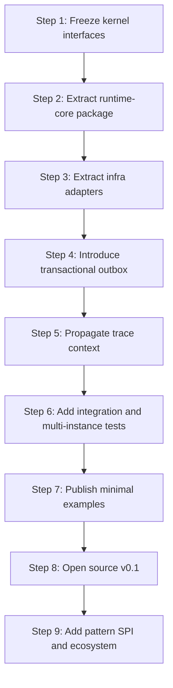

### Step 1: Freeze kernel interfaces

产出：

- `AppSpec`
- `TurnRequest`
- `TurnEvent`
- `TurnResult`
- `RevisionStore`
- `GraphProvider`
- `EventBus`
- `CheckpointStore`
- `ToolExecutor`

### Step 2: Extract runtime-core package

产出：

- 不依赖 FastAPI 的 runtime engine
- 不依赖 `AgentApp` ORM 的 graph compile 输入模型

### Step 3: Extract infra adapters

产出：

- Redis/Postgres adapter
- FastAPI adapter
- SSE adapter

### Step 4: Introduce transactional outbox

产出：

- 强化配置变更后的可靠性闭环

### Step 5: Propagate trace context

产出：

- HTTP -> async turn
- HTTP -> post-commit reconcile

### Step 6: Integration and multi-instance tests

产出：

- docker-compose 驱动的真实验证

### Step 7: Publish minimal examples

产出：

- pure python example
- fastapi example
- multi-instance example

### Step 8: Open source v0.1

产出：

- README
- architecture docs
- extension guide
- compatibility notes

---

## 12. 最终判断

你现在最应该做的，不是继续加“agent 业务功能”，而是把当前这套系统从业务后台里抽成一个有稳定协议的执行内核。

最关键的三件事：

- 先冻结内核协议
- 再补 outbox 可靠性
- 然后补真实集成测试与 trace 跨边界闭环

只要这三件事做完，你这个项目就能从“一个做得比较深的 agent 后端”进入“一个值得开源的 LangGraph 平台级 runtime kernel”。
