# Runtime Side Effect Reliability Plan

这份文档回答一个核心问题：

> 一个平台级 runtime kernel 的 side effect pipeline，为什么最终应建立在 `transactional outbox` 上，而不是长期停留在进程内 `PostCommitWorker` 上？

这份文档现在应被视为：

- `graphlane_runtime_kernel_roadmap.md` 的专题延伸
- 聚焦 runtime kernel 的可靠性设计
- 不再承担“现有业务项目迁移实施方案”的角色

结论先说：

- 不建议长期保留两套正式语义并行
- 建议保留的是“一个统一抽象 + 两种实现”
- 生产目标实现应该收敛到 `transactional outbox`
- `in-memory` / 进程内队列实现只保留给本地开发与轻测试

---

## 1. 为什么不能长期双轨并行

如果未来业务里一部分副作用走：

- `PostCommitWorker` 进程内队列

另一部分走：

- `DB transactional outbox`

那么系统会出现两个问题：

1. 一致性承诺不一致
2. 排障路径不一致
3. 测试矩阵翻倍
4. 对外无法准确描述 runtime kernel 的可靠性边界

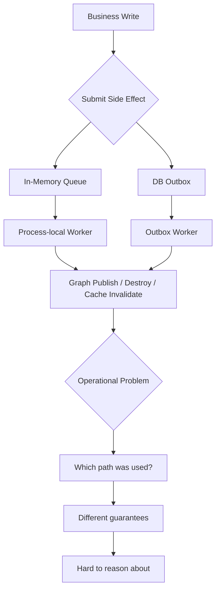

所以正确方向不是“双轨长期并行”，而是：

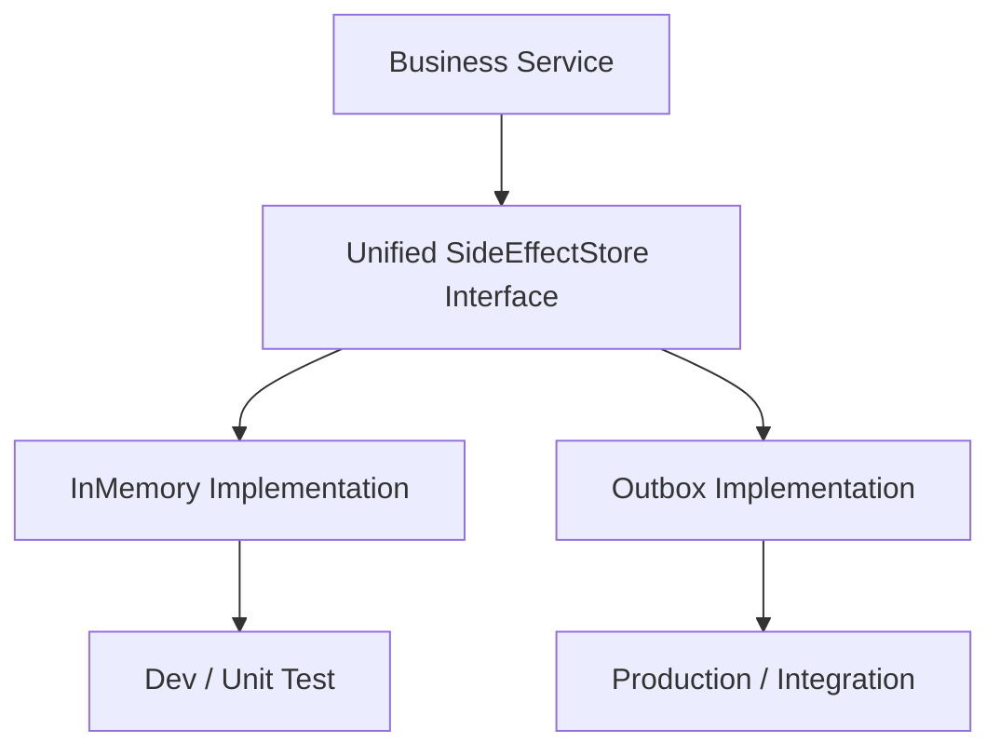

---

## 2. 正确目标：一个抽象，两种实现

### 2.1 抽象层次

建议把现有 `PostCommitWorker` 拆成三个角色：

1. `SideEffectStore`
2. `SideEffectExecutor`
3. `SideEffectWorker`

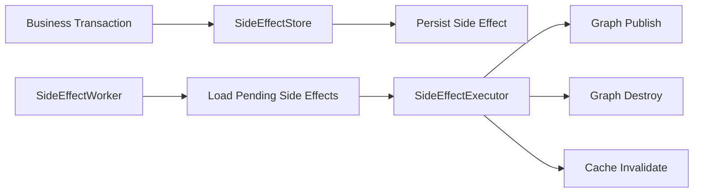

### 2.2 三个角色分别负责什么

#### `SideEffectStore`

职责：

- 接收业务层要提交的副作用
- 决定副作用如何被记录
- 不直接执行副作用

实现：

- `InMemorySideEffectStore`
- `DBOutboxSideEffectStore`

#### `SideEffectExecutor`

职责：

- 真正执行副作用逻辑
- 只关心 task type 和 payload
- 不关心 task 从哪里来

这部分可以直接承接你现在 `PostCommitWorker._dispatch()` 的主要逻辑。

#### `SideEffectWorker`

职责：

- 从某种 store 中持续读取待处理任务
- 调用 executor
- 处理重试、退避、状态流转

实现：

- `InMemorySideEffectWorker`
- `DBOutboxWorker`

---

## 3. `PostCommitWorker` 这类设计在 kernel 里应如何演进

不建议“整体删除后重写”，而建议“拆解复用”。

你现在的 `PostCommitWorker` 里有两部分价值：

### 3.1 应该保留的部分

- task 定义
- task_type 分发
- graph publish / destroy / cache invalidate 的执行逻辑
- retry 语义

### 3.2 不应该继续作为核心机制的部分

- 进程内 `asyncio.Queue`
- `commit` 后再调用 `submit(...)` 的时序

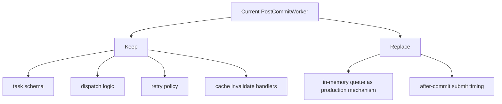

### 3.3 推荐重构结果

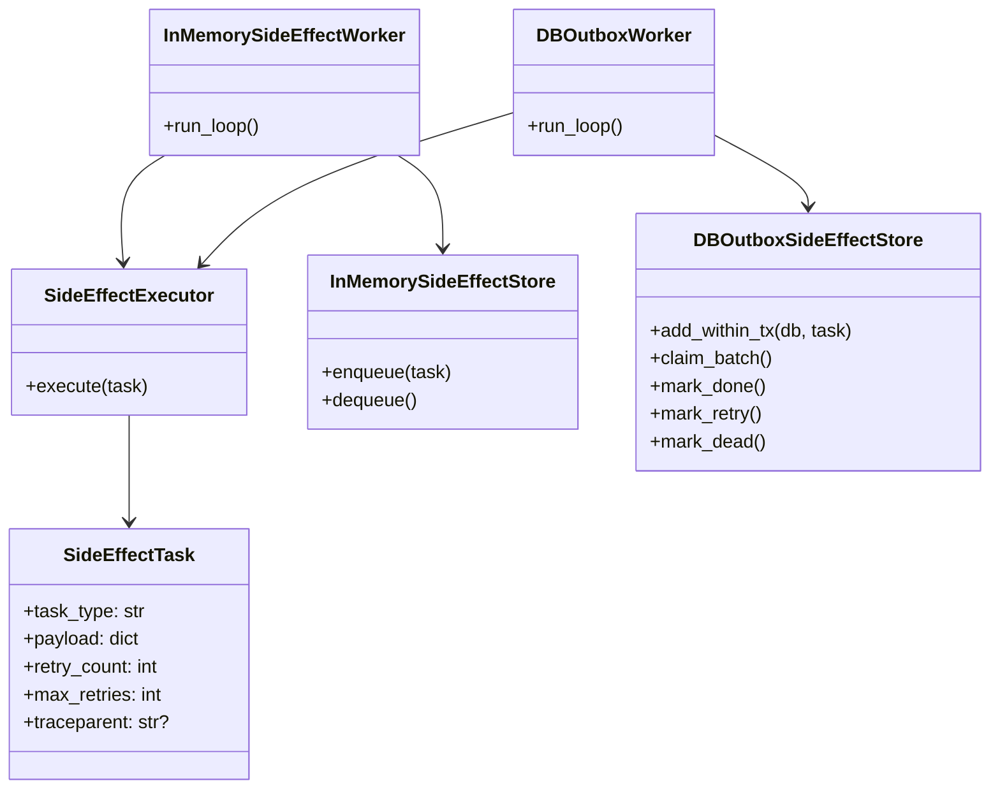

---

## 4. 为什么 `outbox` 是生产目标

当前最大问题不是 worker 执行得慢，而是：

> `db.commit()` 和“副作用被可靠记录”之间不是原子关系

也就是说，当前路径存在这个窗口：

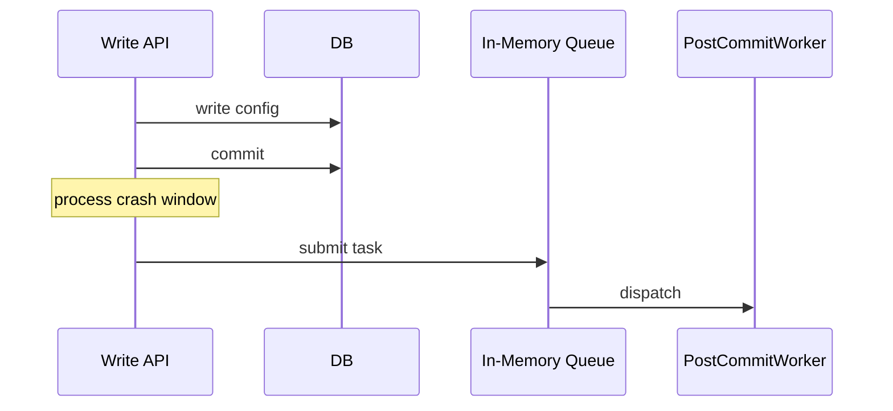

如果进程在 `commit` 成功后、`submit task` 前退出：

- DB 已经更新
- graph publish 没发生
- cache invalidate 没发生
- 运行时和配置事实出现分裂

`outbox` 的价值就在这里：

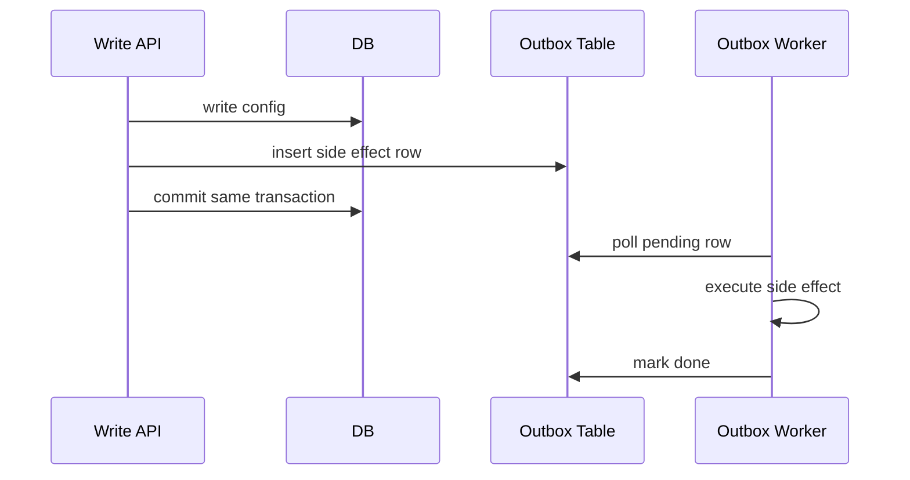

只要事务提交成功：

- 配置事实存在
- side effect 记录也存在
- 后续总能被 worker 捞起来执行

这才是平台级 kernel 应该给的保证。

---

## 5. 推荐的 Outbox 表结构

建议先走最小设计，不要过度复杂。

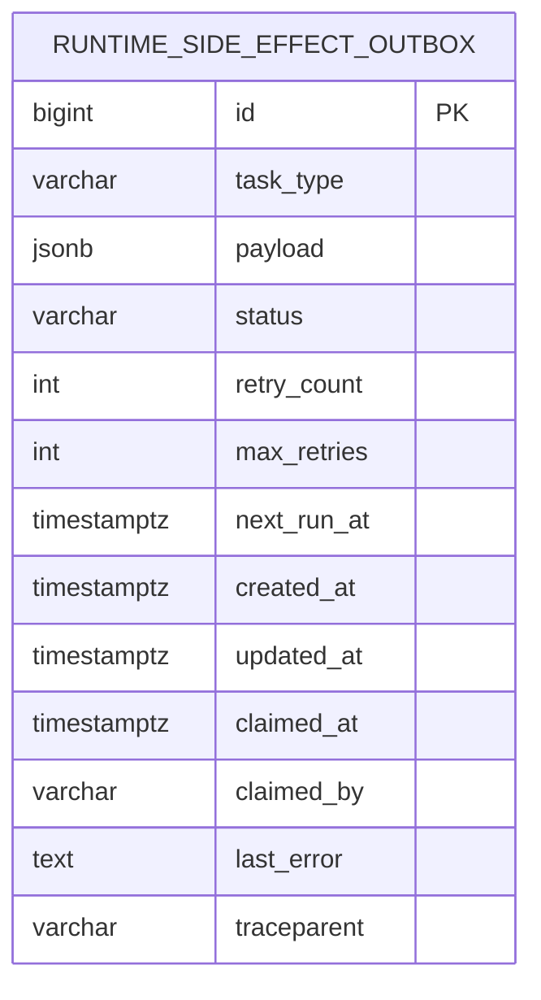

建议字段：

- `id`
- `task_type`
- `payload`
- `status`
  - `pending`
  - `running`
  - `done`
  - `dead`
- `retry_count`
- `max_retries`
- `next_run_at`
- `claimed_at`
- `claimed_by`
- `last_error`
- `traceparent`
- `created_at`
- `updated_at`

任务类型先保持和现有系统一致：

- `graph_publish`
- `graph_destroy`
- `cache_invalidate`

---

## 6. 统一接口应该长什么样

### 6.1 面向 control plane 的写入接口

control plane 不应该再直接调用：

- `post_commit_worker.submit_graph_publish(...)`

而应该调用一个统一的 recorder/store 接口。

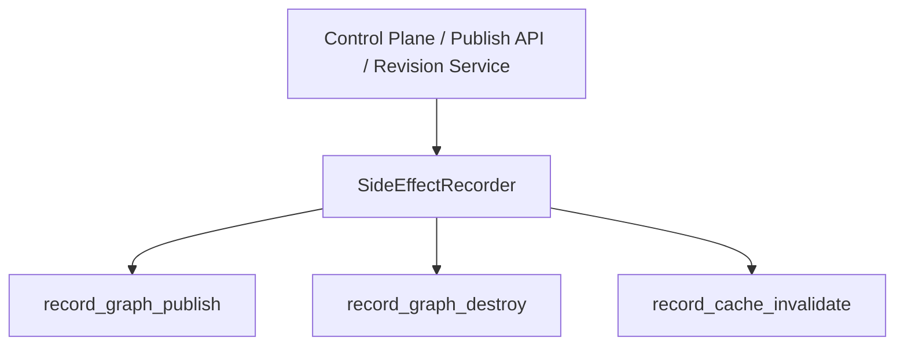

建议接口：

```python
class SideEffectRecorder(Protocol):
    async def record_graph_publish(
        self,
        db: AsyncSession,
        app_id: int,
        version: int,
        traceparent: str | None = None,
    ) -> None: ...

    async def record_graph_destroy(
        self,
        db: AsyncSession,
        app_id: int,
        traceparent: str | None = None,
    ) -> None: ...

    async def record_cache_invalidate(
        self,
        db: AsyncSession,
        cache_type: str,
        payload: dict[str, Any],
        traceparent: str | None = None,
    ) -> None: ...
```

关键点：

- `db` 要传进来
- `record_*` 必须能在业务事务内完成记录
- 对 `outbox` 实现来说，是“往 outbox 表插入记录”
- 对 `in_memory` 实现来说，可以先临时挂在 `db.info` 或事务后 hook 中

---

## 7. 不建议的实现方式

### 7.1 control plane 显式 if/else

不要在业务代码里写：

```python
if use_outbox:
    ...
else:
    ...
```

这会把实现细节污染到所有 control plane service。

### 7.2 一半任务走 outbox，一半任务走旧 worker

这会让：

- graph publish
- cache invalidate
- graph destroy

拥有不同一致性语义，后面非常难收口。

### 7.3 保留 `submit after commit` 作为生产正式路径

这会让你虽然“引入了 outbox”，但核心风险仍没消失。

---

## 8. 推荐演进路线

建议用 5 步实现最终形态。

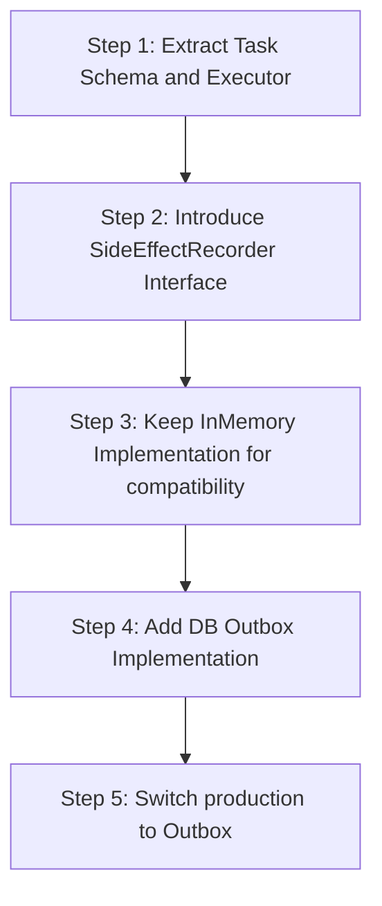

### Step 1: 抽离 task schema 与 executor

目标：

- 保留现有 task payload 语义
- 把 `_dispatch()` 逻辑独立出来

产物：

- `SideEffectTask`
- `SideEffectExecutor`

### Step 2: 引入统一 recorder/store 接口

目标：

- 业务层不再依赖具体 worker

产物：

- `SideEffectRecorder`

### Step 3: 保留本地兼容实现

目标：

- 支持本地开发与轻测试

产物：

- `InMemorySideEffectRecorder`
- `InMemorySideEffectWorker`

但这里要明确：

- 这是开发兼容层
- 不是生产长期目标

### Step 4: 新增 DB Outbox 实现

目标：

- 副作用与业务事务原子落地

产物：

- `runtime_side_effect_outbox` 表
- `DBOutboxSideEffectRecorder`
- `DBOutboxWorker`

### Step 5: 生产切换

目标：

- 让所有关键副作用都走 outbox

产物：

- kernel 默认生产实现切为 `outbox`
- `in_memory` 只保留给 dev/test

---

## 9. Kernel 内部最终形态

当 runtime kernel 最终成形后，side effect pipeline 应该长成这样：

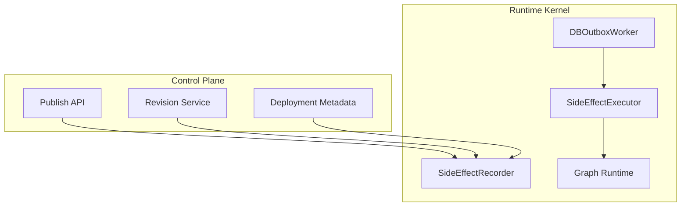

control plane 负责：

- 记录 revision / deployment 事实
- 把 side effect 记录给 kernel 可靠性层

kernel 负责：

- 副作用可靠记录
- worker 消费
- runtime graph 更新
- cache invalidate

这样 runtime kernel 的边界才是清晰的。

---

## 10. trace context 应该一起设计

既然要设计 side effect pipeline，建议顺手把 trace context 一起补上。

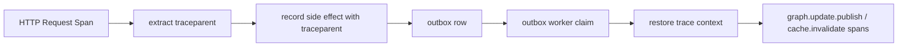

这样就能把：

- 写配置请求
- outbox 消费
- graph publish
- graph consume

串成一条完整 trace。

这对 kernel 非常重要。

---

## 11. 最终建议

一句话总结：

> 不是“立即粗暴删掉 `PostCommitWorker`”，也不是“长期双轨并行”，而是“先抽象 side effect pipeline，再让生产正式收敛到 outbox”。

最推荐的最终状态：

- 统一业务接口：`SideEffectRecorder`
- 统一执行逻辑：`SideEffectExecutor`
- 生产实现：`DBOutboxWorker`
- 本地/测试实现：`InMemorySideEffectWorker`

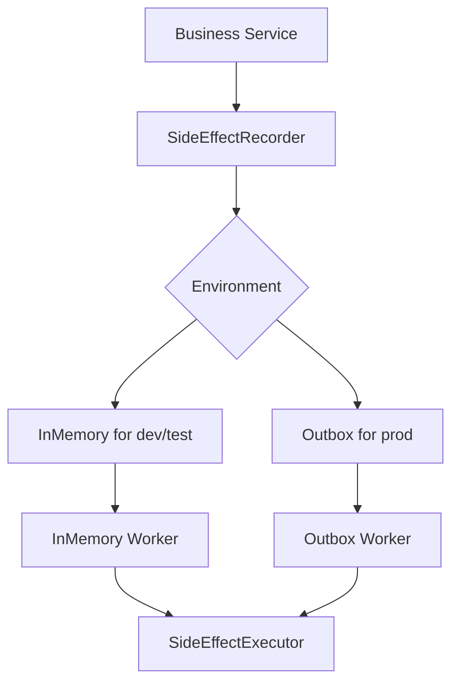

这条路的好处是：

- 对外语义统一
- 内部实现可迁移
- 生产可靠性补强
- 现有代码可以平滑回接未来的 PyPI module

---

## 12. 下一步建议

如果接下来继续推进，建议按这个顺序落地：

1. 先把当前 `PostCommitWorker` 的 task model 和 `_dispatch` 抽出来
2. 定义 `SideEffectRecorder` / `SideEffectExecutor` 接口
3. 设计并创建 outbox 表
4. 把 control plane 写路径改为走统一 recorder
5. 增加 `DBOutboxWorker`
6. 增加 integration tests
7. 最后切换生产默认实现
