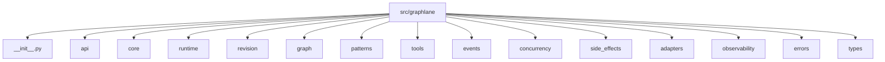
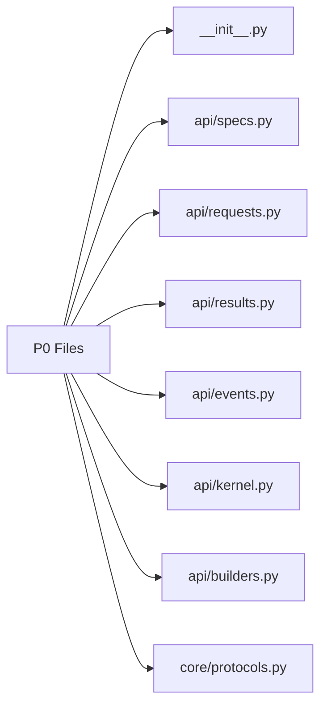
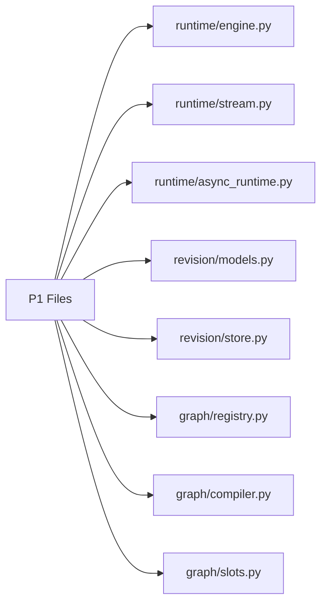
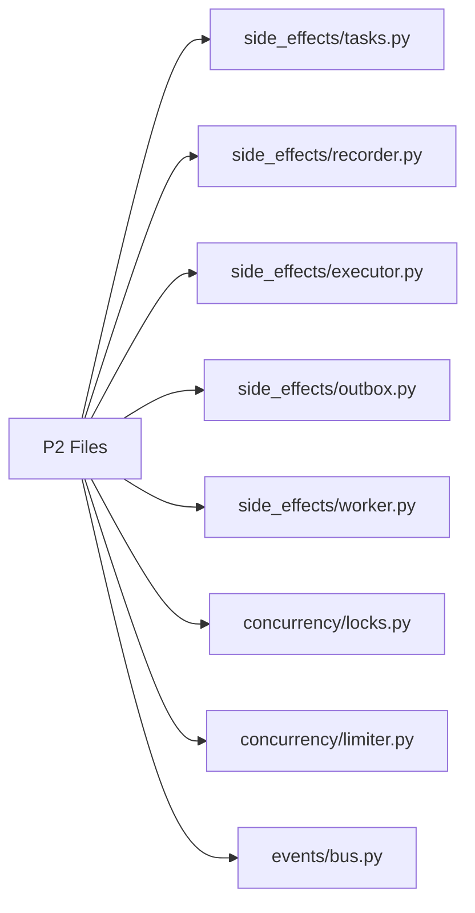
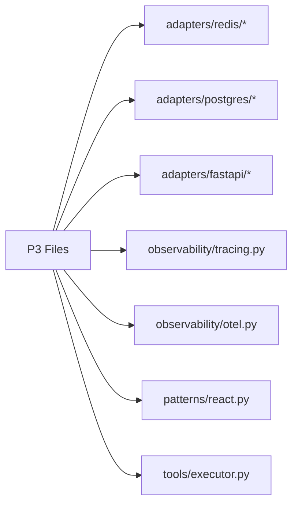
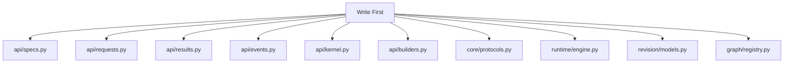
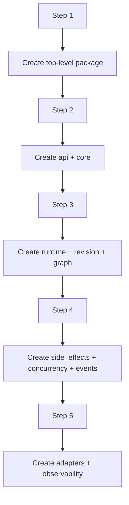
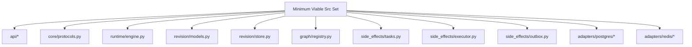

# Src Layout Draft

这份文档把前面的包结构进一步落到 `graphlane` 的“文件级骨架”。

目标不是现在就把所有代码写出来，而是先回答：

- `src/graphlane/` 里第一版到底有哪些文件
- 每个文件负责什么
- 哪些文件必须先建
- 哪些文件可以后补

一句话目标：

> 让项目进入“可以开始抽代码”的状态。

---

## 1. 顶层目标结构

建议第一版先落成下面这个骨架。



建议的目录树：

```text
src/graphlane/
  __init__.py
  py.typed
  api/
  core/
  runtime/
  revision/
  graph/
  patterns/
  tools/
  events/
  concurrency/
  side_effects/
  adapters/
  observability/
  errors/
  types/
```

---

## 2. 第一优先级文件

这些文件建议最先建出来，因为它们决定公共表面和主干结构。



### 2.1 `__init__.py`

职责：

- 暴露第一版顶层公共导入路径

应导出：

- `RuntimeKernel`
- `AppSpec`
- `ModelSpec`
- `ToolBinding`
- `TurnRequest`
- `TurnEvent`
- `TurnResult`

### 2.2 `api/specs.py`

职责：

- 定义 `AppSpec`
- 定义 `ModelSpec`
- 定义 `ToolBinding`

这是 runtime 配置公共表面最核心的文件之一。

### 2.3 `api/requests.py`

职责：

- 定义 `TurnRequest`

### 2.4 `api/results.py`

职责：

- 定义 `TurnResult`

### 2.5 `api/events.py`

职责：

- 定义 `TurnEvent`
- 定义稳定事件类型常量

### 2.6 `api/kernel.py`

职责：

- 定义 `RuntimeKernel` 协议或抽象类

### 2.7 `api/builders.py`

职责：

- 定义 `KernelBuilder`

### 2.8 `core/protocols.py`

职责：

- 定义底层接口协议

例如：

- `RevisionStore`
- `CheckpointStore`
- `EventBus`
- `LockManager`
- `Limiter`
- `ToolExecutor`
- `PatternRegistry`
- `SideEffectRecorder`

---

## 3. 第二优先级文件

这些文件决定 runtime 主闭环。



### 3.1 `runtime/engine.py`

职责：

- 一次 turn 的主执行引擎
- 实现 `invoke`
- 驱动 `stream`

### 3.2 `runtime/stream.py`

职责：

- turn event 流的组装
- `assistant_delta` / `tool_start` / `tool_end` / `done` 语义适配

### 3.3 `runtime/async_runtime.py`

职责：

- `submit_async`
- `subscribe_async`

### 3.4 `revision/models.py`

职责：

- 定义 `RevisionSnapshot`
- 定义 active revision metadata

### 3.5 `revision/store.py`

职责：

- 定义 revision 读写语义
- active revision 切换协议

### 3.6 `graph/registry.py`

职责：

- graph 取用
- active graph 管理
- lazy load
- hot switch

### 3.7 `graph/compiler.py`

职责：

- 从 `AppSpec` 编译 graph

### 3.8 `graph/slots.py`

职责：

- active/history slot 内部结构

注意：

- 这是内部文件
- 不应进入 README 主路径

---

## 4. 第三优先级文件

这些文件决定可靠性、并发和正式可用性。



### 4.1 `side_effects/tasks.py`

职责：

- 定义 `SideEffectTask`
- 定义 task type 常量

### 4.2 `side_effects/recorder.py`

职责：

- 定义 `SideEffectRecorder`

### 4.3 `side_effects/executor.py`

职责：

- 执行 `graph_publish`
- 执行 `graph_destroy`
- 执行 `cache_invalidate`

### 4.4 `side_effects/outbox.py`

职责：

- outbox 存储协议
- outbox 记录状态模型

### 4.5 `side_effects/worker.py`

职责：

- outbox worker
- retry / backoff

### 4.6 `concurrency/locks.py`

职责：

- `LockManager`
- session execution lock 协议

### 4.7 `concurrency/limiter.py`

职责：

- `Limiter`
- global limiter 协议

### 4.8 `events/bus.py`

职责：

- `EventBus`
- async turn 事件总线协议

---

## 5. 第四优先级文件

这些文件是可运行生态和官方适配器。



### 5.1 `adapters/redis/`

建议文件：

- `event_bus.py`
- `locks.py`
- `limiter.py`
- `pubsub.py`

### 5.2 `adapters/postgres/`

建议文件：

- `revision_store.py`
- `checkpoint_store.py`
- `outbox_store.py`

### 5.3 `adapters/fastapi/`

建议文件：

- `app.py`
- `routes.py`
- `sse.py`
- `deps.py`

### 5.4 `observability/`

建议文件：

- `tracing.py`
- `otel.py`

### 5.5 `patterns/react.py`

职责：

- 第一版唯一内置 pattern 参考实现

### 5.6 `tools/executor.py`

职责：

- 第一版工具执行装配逻辑

---

## 6. 建议的完整文件树草案

```text
src/graphlane/
  __init__.py
  py.typed
  api/
    __init__.py
    specs.py
    requests.py
    results.py
    events.py
    kernel.py
    builders.py
  core/
    __init__.py
    protocols.py
    lifecycle.py
    constants.py
  runtime/
    __init__.py
    engine.py
    stream.py
    async_runtime.py
    finalizer.py
  revision/
    __init__.py
    models.py
    store.py
    publish.py
  graph/
    __init__.py
    registry.py
    compiler.py
    slots.py
    cleanup.py
  patterns/
    __init__.py
    base.py
    registry.py
    react.py
  tools/
    __init__.py
    binding.py
    schema.py
    executor.py
    sandbox.py
  events/
    __init__.py
    turn.py
    tool.py
    bus.py
  concurrency/
    __init__.py
    locks.py
    limiter.py
  side_effects/
    __init__.py
    tasks.py
    recorder.py
    executor.py
    outbox.py
    worker.py
    retry.py
  adapters/
    __init__.py
    fastapi/
      __init__.py
      app.py
      routes.py
      sse.py
      deps.py
    redis/
      __init__.py
      event_bus.py
      locks.py
      limiter.py
      pubsub.py
    postgres/
      __init__.py
      revision_store.py
      checkpoint_store.py
      outbox_store.py
    sqlite/
      __init__.py
      revision_store.py
      checkpoint_store.py
  observability/
    __init__.py
    tracing.py
    otel.py
  errors/
    __init__.py
    runtime.py
    revision.py
    concurrency.py
    config.py
  types/
    __init__.py
    common.py
```

---

## 7. 哪些文件必须先写“真实内容”

不是所有文件都要一开始就写满。

第一批建议先写实内容的文件：



原因：

- 这些文件决定主语义
- 后面其他文件都要依赖它们

---

## 8. 哪些文件可以先放“空骨架”

可以先建立但暂时只写最小占位的文件：

- `graph/cleanup.py`
- `tools/sandbox.py`
- `patterns/registry.py`
- `adapters/sqlite/*`
- `observability/otel.py`

原则：

- 先占位没问题
- 但不要让 README 提前依赖这些未成熟文件

---

## 9. 建议的文件创建顺序



更具体一点：

1. 建 `src/graphlane/__init__.py`
2. 建 `api/` 和 `core/`
3. 建 `runtime/`、`revision/`、`graph/`
4. 建 `side_effects/`、`concurrency/`、`events/`
5. 建 `adapters/`、`observability/`

---

## 10. 文件级职责边界

这里最重要的是避免职责再次混乱。

### 10.1 `api/*`

- 只放公共对象
- 不放 Redis/Postgres/FastAPI 代码

### 10.2 `runtime/*`

- 只关心 turn 执行
- 不关心 HTTP 协议

### 10.3 `revision/*`

- 只关心 revision snapshot 和 active revision
- 不关心 draft/version UI

### 10.4 `graph/*`

- 只关心 graph 生命周期
- 不关心租户、用户、后台业务逻辑

### 10.5 `side_effects/*`

- 只关心可靠性执行链
- 不关心业务“为什么发布”

### 10.6 `adapters/*`

- 只关心如何把协议接到具体基础设施

---

## 11. 一阶段最小落地集

如果你想用最少代码先跑通第一版，建议最低实现集是：



也就是说，第一批真正值得投入精力的代码，不要铺太散。

---

## 12. 最终建议

一句话总结：

> 先把 `src/graphlane/` 的文件级骨架立起来，再按 `api/core -> runtime/revision/graph -> side_effects/concurrency/events -> adapters/observability` 的顺序逐层填充。

这样做的好处是：

- 文件边界清晰
- 公共 API 不容易跑偏
- 后续开始真正抽代码时，不会一边写一边重新想结构

如果按这份文档推进，下一步就可以直接进入：

- `graphlane_init_files_plan.md`

也就是把第一批要创建的文件，进一步细化到“每个文件先写哪些类、哪些函数、哪些空实现”。*** End Patch
