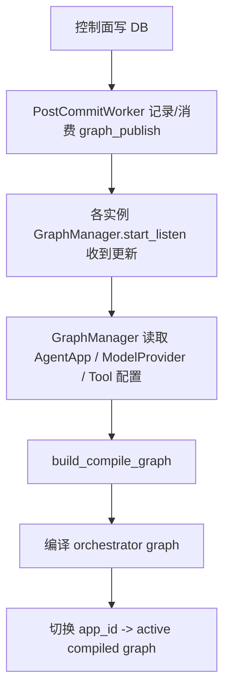
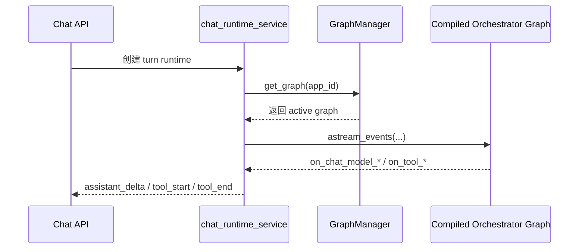
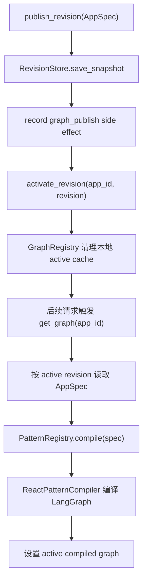
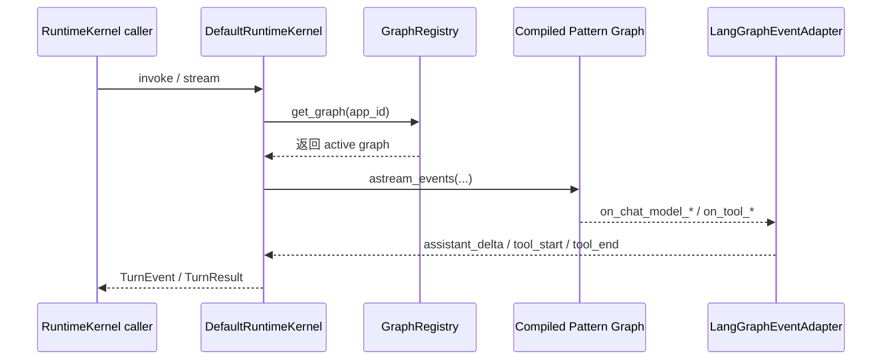
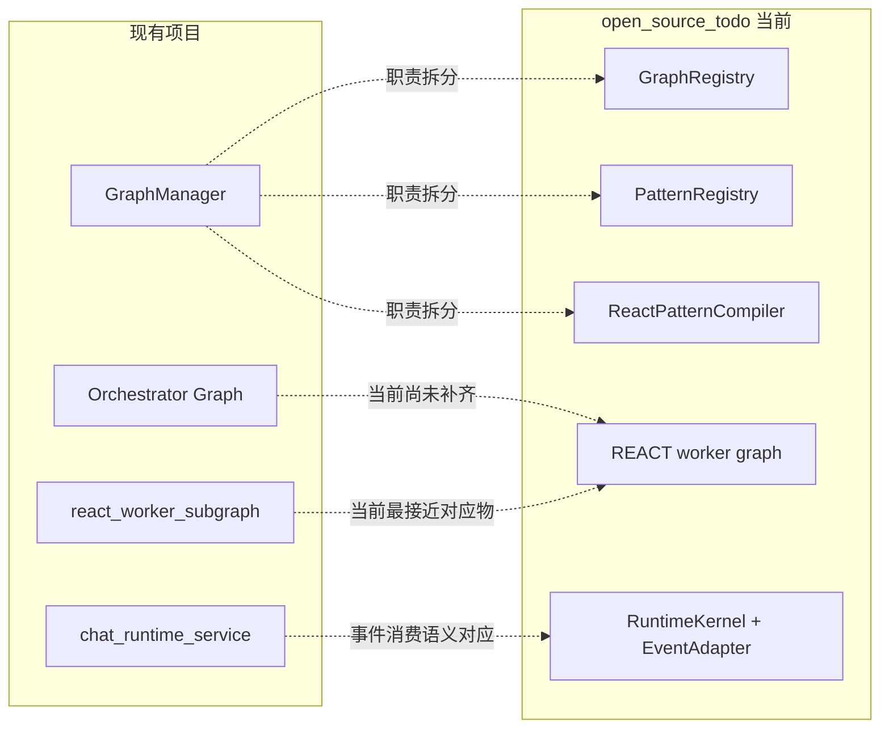
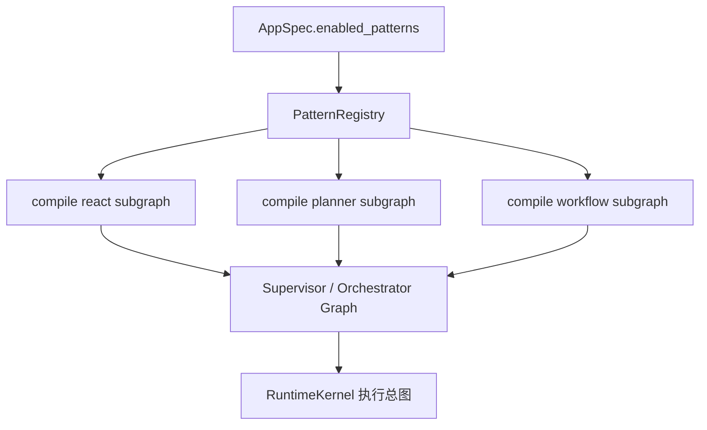

# GraphManager To Kernel Workflow

适用时间：2026-04-05

这份文档只回答一个问题：

> 现有项目里的 `GraphManager` 主链路，映射到 `open_source_todo` 这个新内核后，流程到底变成了什么样？

重点不是目录结构，而是把“同一件事”在两套体系里的执行路径对齐出来。

## 1. 先给一句话结论

- 现有项目里的 `GraphManager`，本质上是“graph registry + graph compiler + active pointer + hot update listener”的组合体
- `open_source_todo` 现在把这几个职责拆开了
- 当前的 `REACT` 不是最终 supervisor 总图，而是一个可独立执行的 worker graph
- 后续目标不是重写 `REACT`，而是把 `REACT` 这种 worker graph 收敛成可注入的 subgraph，再组合成 supervisor / orchestrator 总图

## 2. 两套体系的对象对位

| 现有项目 | 新内核 | 当前职责 |
| --- | --- | --- |
| `GraphManager` | `GraphRegistry` | 取 graph、维护 active revision、懒加载、切换 |
| `build_compile_graph(...)` | `PatternRegistry` + `ReactPatternCompiler` | 根据配置编译 LangGraph |
| `AgentApp` + 相关运行时配置 | `AppSpec` | revision 下的完整运行时快照 |
| `PostCommitWorker` 广播图更新 | `SideEffectRecorder` + `graph_publish` | 发布 revision 后切换 active pointer |
| `chat_runtime_service.py` 消费 `graph.astream_events(...)` | `runtime/stream.py` | 消费 LangGraph 原生事件并映射统一事件模型 |
| GraphManager 里的 orchestrator graph | 未来的 supervisor / orchestrator graph | 组合多个 pattern subgraph |
| `react_worker_subgraph` | 当前 `REACT` pattern | 单个 worker graph，可被复用 |

## 3. 现有项目里的主链路

### 3.1 配置发布到可执行 graph

这里的关键点是：

- `GraphManager` 不只是缓存
- 它同时承担了“读取配置事实 -> 编译总图 -> 切 active 指针”的职责

对应代码里的总图编排形态可以直接看：

- [hot_update_service.py](/home/raiseexception/python_projects/ai_management_platform/app/service/agent_app/hot_update_service.py#L611)

那里面已经是：

- `prepare_orchestration`
- `router`
- `react_worker`
- `decider`

也就是说，现有项目真正编出来的不是单个 `REACT` worker graph，而是一张 supervisor / orchestrator 总图。

### 3.2 聊天执行链路

这里的关键点是：

- 现有项目真正消费的是 `graph.astream_events(...)`
- 也就是说，事件语义来自 LangGraph 原生 runnable，而不是 API 层手搓

对应消费点：

- [chat_runtime_service.py](/home/raiseexception/python_projects/ai_management_platform/app/service/agent_app/chat_runtime_service.py#L392)

## 4. 新内核当前已经走到哪一步

### 4.1 revision 发布到可执行 graph

这里和现有项目最像的部分是：

- `GraphRegistry` 对应 `GraphManager` 的 graph registry 能力
- `AppSpec revision` 对应现有项目里“从 DB 读出的运行时事实”

对应 scope 里的原始目标：

- [graphlane_phase1_scope.md](/home/raiseexception/python_projects/ai_management_platform/open_source_todo/docs/graphlane_phase1_scope.md#L68)

### 4.2 turn 执行链路

当前关键代码：

- [engine.py](/home/raiseexception/python_projects/ai_management_platform/open_source_todo/src/graphlane/runtime/engine.py#L167)
- [stream.py](/home/raiseexception/python_projects/ai_management_platform/open_source_todo/src/graphlane/runtime/stream.py#L37)
- [react.py](/home/raiseexception/python_projects/ai_management_platform/open_source_todo/src/graphlane/patterns/react.py#L100)

当前已经成立的点：

- `REACT` 用真实 `init_chat_model(...)`
- `REACT` 用真实 `ToolNode`
- runtime 消费真实 `graph.astream_events(...)`

## 5. 现在最容易混淆的地方

### 5.1 误区：以为 `REACT` 就等于 GraphManager 里的总图

不是。

现有项目里的 `GraphManager` 编出来的是：

- orchestrator graph
  - `prepare_orchestration`
  - `router`
  - `react_worker`
  - `decider`

而 `open_source_todo` 当前的 `REACT` 只相当于这里面的：

- `react_worker`

也就是说：

- 现有项目：已经有“总图 + worker subgraph”
- 新内核当前：只有“worker graph 参考实现”

### 5.2 误区：以为新内核现在少走了一层就是退化

也不是。

这是刻意的阶段收敛。

Phase 1 先做的是：

- 把单个 pattern 模块做实
- 把 graph registry / revision / event model 这些内核协议做稳

而不是一开始就把 router / decider / multi-pattern orchestrator 全做出来。

## 6. 真正的对比结论

可以把现在的新内核理解成下面这张映射图：

一句话说清楚就是：

> 现有项目里的 `GraphManager` = “总图编译与调度中心”；新内核当前只把其中最核心、最稳定、最可复用的那部分先拆成了 `GraphRegistry + PatternCompiler + RuntimeKernel`，而 `REACT` 目前只是可单独运行的 worker graph。

## 7. 后续应该怎么长成和 GraphManager 更像的流程

后续真正要补的是这层：

那时的关系就会变成：

- `ReactPatternCompiler`
  - 不再只是“编完整 graph”
  - 而是“编一个可插拔 subgraph”
- supervisor / orchestrator compiler
  - 负责把多个 pattern subgraph 组装成总图
- `GraphRegistry`
  - 负责 revision 下 active 总图的切换

这就会更接近现有项目里 `GraphManager` 的最终形态。

## 8. 现在看流程时的建议阅读顺序

如果你想把两套系统对齐着看，建议按这个顺序：

1. 现有项目里的 [system_runtime_overview.md](/home/raiseexception/python_projects/ai_management_platform/workflow/system/system_runtime_overview.md)
2. 现有项目里的 [hot_update_service.py](/home/raiseexception/python_projects/ai_management_platform/app/service/agent_app/hot_update_service.py#L611)
3. 新内核里的 [graphlane_phase1_scope.md](/home/raiseexception/python_projects/ai_management_platform/open_source_todo/docs/graphlane_phase1_scope.md#L68)
4. 新内核里的 [07_graph_compilation_and_patterns.md](/home/raiseexception/python_projects/ai_management_platform/open_source_todo/todo_list/07_graph_compilation_and_patterns.md)
5. 新内核里的 [react.py](/home/raiseexception/python_projects/ai_management_platform/open_source_todo/src/graphlane/patterns/react.py#L100)
6. 新内核里的 [engine.py](/home/raiseexception/python_projects/ai_management_platform/open_source_todo/src/graphlane/runtime/engine.py#L167)

## 9. 当前最准确的阶段描述

当前不要把 `open_source_todo` 理解成：

- 一个已经等价替代 `GraphManager` 的完整 supervisor runtime

应该理解成：

- 一个正在把 `GraphManager` 拆解成平台级内核协议的 Phase 1 内核
- 其中 `REACT` 已经做成了真实可执行的 worker pattern
- 下一步才是把这些 pattern worker 收敛成可组合 subgraph，再进入 supervisor / orchestrator 总图阶段
